# retrieva

## Tables

| Name                                                                              | Columns | Comment | Type       |
| --------------------------------------------------------------------------------- | ------- | ------- | ---------- |
| [public.arrangements](public.arrangements.md)                                     | 16      |         | BASE TABLE |
| [public.assessments](public.assessments.md)                                       | 15      |         | BASE TABLE |
| [public.audit_log](public.audit_log.md)                                           | 9       |         | BASE TABLE |
| [public.business_functions](public.business_functions.md)                         | 8       |         | BASE TABLE |
| [public.conversations](public.conversations.md)                                   | 9       |         | BASE TABLE |
| [public.critical_function_dependencies](public.critical_function_dependencies.md) | 2       |         | BASE TABLE |
| [public.critical_functions](public.critical_functions.md)                         | 8       |         | BASE TABLE |
| [public.evidence](public.evidence.md)                                             | 17      |         | BASE TABLE |
| [public.evidence_collection_request](public.evidence_collection_request.md)       | 15      |         | BASE TABLE |
| [public.findings](public.findings.md)                                             | 17      |         | BASE TABLE |
| [public.ict_services](public.ict_services.md)                                     | 8       |         | BASE TABLE |
| [public.legal_entities](public.legal_entities.md)                                 | 9       |         | BASE TABLE |
| [public.messages](public.messages.md)                                             | 11      |         | BASE TABLE |
| [public.organization_members](public.organization_members.md)                     | 13      |         | BASE TABLE |
| [public.organizations](public.organizations.md)                                   | 12      |         | BASE TABLE |
| [public.provider_dependencies](public.provider_dependencies.md)                   | 12      |         | BASE TABLE |
| [public.provider_nodes](public.provider_nodes.md)                                 | 11      |         | BASE TABLE |
| [public.questionnaire_templates](public.questionnaire_templates.md)               | 7       |         | BASE TABLE |
| [public.risks](public.risks.md)                                                   | 16      |         | BASE TABLE |
| [public.role_assignments](public.role_assignments.md)                             | 7       |         | BASE TABLE |
| [public.users](public.users.md)                                                   | 26      |         | BASE TABLE |
| [public.vendor_questionnaires](public.vendor_questionnaires.md)                   | 20      |         | BASE TABLE |
| [public.workspace_members](public.workspace_members.md)                           | 10      |         | BASE TABLE |
| [public.workspaces](public.workspaces.md)                                         | 19      |         | BASE TABLE |

## Stored procedures and functions

| Name                       | ReturnType | Arguments | Type     |
| -------------------------- | ---------- | --------- | -------- |
| public.audit_log_immutable | trigger    |           | FUNCTION |

## Enums

| Name                           | Values                                                                                                                                                           |
| ------------------------------ | ---------------------------------------------------------------------------------------------------------------------------------------------------------------- |
| public.arrangement_lifecycle   | active, due_diligence, exited, exiting, prospect, remediation, under_review                                                                                      |
| public.arrangement_type        | external, intra_group                                                                                                                                            |
| public.assessment_framework    | CONTRACT_A30, DORA                                                                                                                                               |
| public.assessment_status       | analyzing, complete, failed, indexing, pending                                                                                                                   |
| public.criticality             | critical, important                                                                                                                                              |
| public.dependency_level        | high, low, medium                                                                                                                                                |
| public.domain_role             | analyst, auditor, business_owner, dpo, entity_admin, group_admin, group_compliance, group_risk, ict_risk_officer, legal, vendor_contact, viewer                  |
| public.evidence_category       | bcp_dr_plan, dora_addendum, exit_strategy, iso27001_cert, master_service_agreement, risk_classification, soc2_report, subprocessor_list, vendor_dora_attestation |
| public.evidence_request_status | fulfilled, pending, revoked                                                                                                                                      |
| public.evidence_scope          | arrangement, provider                                                                                                                                            |
| public.exit_difficulty         | high, low, medium                                                                                                                                                |
| public.finding_status          | approved, draft, rejected                                                                                                                                        |
| public.member_status           | active, pending, revoked                                                                                                                                         |
| public.message_role            | assistant, user                                                                                                                                                  |
| public.org_member_role         | analyst, org_admin, viewer                                                                                                                                       |
| public.org_plan_status         | active, canceled, past_due, paused, trialing                                                                                                                     |
| public.provider_node_kind      | external, workspace                                                                                                                                              |
| public.provider_source         | extracted, manual                                                                                                                                                |
| public.questionnaire_status    | complete, draft, expired, failed, partial, sent                                                                                                                  |
| public.risk_severity           | critical, high, low, medium                                                                                                                                      |
| public.risk_status             | accepted, closed, mitigated, mitigating, open                                                                                                                    |
| public.scope_type              | entity, group, legal_entity                                                                                                                                      |
| public.tier                    | critical, important, standard                                                                                                                                    |
| public.user_role               | admin, user                                                                                                                                                      |
| public.vendor_status           | active, exited, under-review                                                                                                                                     |
| public.verdict                 | compliant, insufficient_evidence, non_compliant, not_applicable, partial                                                                                         |
| public.workspace_member_role   | member, owner, viewer                                                                                                                                            |
| public.workspace_sync_status   | error, idle, synced, syncing                                                                                                                                     |

## Relations

```mermaid
erDiagram

"public.arrangements" }o--o| "public.users" : "FOREIGN KEY (created_by) REFERENCES users(id) ON DELETE SET NULL"
"public.arrangements" }o--|| "public.organizations" : "FOREIGN KEY (organization_id) REFERENCES organizations(id) ON DELETE CASCADE"
"public.arrangements" }o--|| "public.provider_nodes" : "FOREIGN KEY (provider_id) REFERENCES provider_nodes(id) ON DELETE CASCADE"
"public.arrangements" }o--|| "public.legal_entities" : "FOREIGN KEY (legal_entity_id) REFERENCES legal_entities(id) ON DELETE CASCADE"
"public.arrangements" }o--|| "public.business_functions" : "FOREIGN KEY (business_function_id) REFERENCES business_functions(id) ON DELETE CASCADE"
"public.arrangements" }o--o| "public.ict_services" : "FOREIGN KEY (ict_service_id) REFERENCES ict_services(id) ON DELETE SET NULL"
"public.assessments" }o--o| "public.users" : "FOREIGN KEY (created_by) REFERENCES users(id) ON DELETE SET NULL"
"public.assessments" }o--|| "public.workspaces" : "FOREIGN KEY (workspace_id) REFERENCES workspaces(id) ON DELETE CASCADE"
"public.audit_log" }o--o| "public.users" : "FOREIGN KEY (actor) REFERENCES users(id) ON DELETE SET NULL"
"public.audit_log" }o--|| "public.organizations" : "FOREIGN KEY (organization_id) REFERENCES organizations(id) ON DELETE CASCADE"
"public.business_functions" }o--|| "public.organizations" : "FOREIGN KEY (organization_id) REFERENCES organizations(id) ON DELETE CASCADE"
"public.business_functions" }o--|| "public.legal_entities" : "FOREIGN KEY (legal_entity_id) REFERENCES legal_entities(id) ON DELETE CASCADE"
"public.conversations" }o--o| "public.users" : "FOREIGN KEY (user_id) REFERENCES users(id) ON DELETE SET NULL"
"public.conversations" }o--o| "public.workspaces" : "FOREIGN KEY (workspace_id) REFERENCES workspaces(id) ON DELETE CASCADE"
"public.critical_function_dependencies" }o--|| "public.workspaces" : "FOREIGN KEY (workspace_id) REFERENCES workspaces(id) ON DELETE CASCADE"
"public.critical_function_dependencies" }o--|| "public.critical_functions" : "FOREIGN KEY (critical_function_id) REFERENCES critical_functions(id) ON DELETE CASCADE"
"public.critical_functions" }o--o| "public.users" : "FOREIGN KEY (created_by) REFERENCES users(id) ON DELETE SET NULL"
"public.critical_functions" }o--|| "public.organizations" : "FOREIGN KEY (organization_id) REFERENCES organizations(id) ON DELETE CASCADE"
"public.evidence" }o--o| "public.users" : "FOREIGN KEY (created_by) REFERENCES users(id) ON DELETE SET NULL"
"public.evidence" }o--|| "public.organizations" : "FOREIGN KEY (organization_id) REFERENCES organizations(id) ON DELETE CASCADE"
"public.evidence" }o--o| "public.provider_nodes" : "FOREIGN KEY (provider_id) REFERENCES provider_nodes(id) ON DELETE CASCADE"
"public.evidence" }o--o| "public.ict_services" : "FOREIGN KEY (service_id) REFERENCES ict_services(id) ON DELETE SET NULL"
"public.evidence" }o--o| "public.arrangements" : "FOREIGN KEY (arrangement_id) REFERENCES arrangements(id) ON DELETE CASCADE"
"public.evidence_collection_request" }o--o| "public.users" : "FOREIGN KEY (created_by) REFERENCES users(id) ON DELETE SET NULL"
"public.evidence_collection_request" }o--|| "public.organizations" : "FOREIGN KEY (organization_id) REFERENCES organizations(id) ON DELETE CASCADE"
"public.evidence_collection_request" }o--|| "public.arrangements" : "FOREIGN KEY (arrangement_id) REFERENCES arrangements(id) ON DELETE CASCADE"
"public.findings" }o--o| "public.users" : "FOREIGN KEY (created_by) REFERENCES users(id) ON DELETE SET NULL"
"public.findings" }o--o| "public.users" : "FOREIGN KEY (decided_by) REFERENCES users(id) ON DELETE SET NULL"
"public.findings" }o--|| "public.organizations" : "FOREIGN KEY (organization_id) REFERENCES organizations(id) ON DELETE CASCADE"
"public.findings" }o--|| "public.arrangements" : "FOREIGN KEY (arrangement_id) REFERENCES arrangements(id) ON DELETE CASCADE"
"public.ict_services" }o--|| "public.organizations" : "FOREIGN KEY (organization_id) REFERENCES organizations(id) ON DELETE CASCADE"
"public.ict_services" }o--|| "public.provider_nodes" : "FOREIGN KEY (provider_id) REFERENCES provider_nodes(id) ON DELETE CASCADE"
"public.legal_entities" }o--|| "public.organizations" : "FOREIGN KEY (organization_id) REFERENCES organizations(id) ON DELETE CASCADE"
"public.legal_entities" }o--o| "public.legal_entities" : "FOREIGN KEY (parent_entity_id) REFERENCES legal_entities(id) ON DELETE SET NULL"
"public.messages" }o--|| "public.conversations" : "FOREIGN KEY (conversation_id) REFERENCES conversations(id) ON DELETE CASCADE"
"public.organization_members" }o--o| "public.users" : "FOREIGN KEY (invited_by) REFERENCES users(id) ON DELETE SET NULL"
"public.organization_members" }o--o| "public.users" : "FOREIGN KEY (user_id) REFERENCES users(id) ON DELETE SET NULL"
"public.organization_members" }o--|| "public.organizations" : "FOREIGN KEY (organization_id) REFERENCES organizations(id) ON DELETE CASCADE"
"public.organizations" }o--|| "public.users" : "FOREIGN KEY (owner_id) REFERENCES users(id)"
"public.provider_dependencies" }o--o| "public.users" : "FOREIGN KEY (created_by) REFERENCES users(id) ON DELETE SET NULL"
"public.provider_dependencies" }o--|| "public.organizations" : "FOREIGN KEY (organization_id) REFERENCES organizations(id) ON DELETE CASCADE"
"public.provider_dependencies" }o--|| "public.provider_nodes" : "FOREIGN KEY (child_node_id) REFERENCES provider_nodes(id) ON DELETE CASCADE"
"public.provider_dependencies" }o--|| "public.provider_nodes" : "FOREIGN KEY (parent_node_id) REFERENCES provider_nodes(id) ON DELETE CASCADE"
"public.provider_nodes" }o--|| "public.organizations" : "FOREIGN KEY (organization_id) REFERENCES organizations(id) ON DELETE CASCADE"
"public.provider_nodes" }o--o| "public.workspaces" : "FOREIGN KEY (workspace_id) REFERENCES workspaces(id) ON DELETE CASCADE"
"public.risks" }o--o| "public.users" : "FOREIGN KEY (opened_by) REFERENCES users(id) ON DELETE SET NULL"
"public.risks" }o--o| "public.users" : "FOREIGN KEY (owner_id) REFERENCES users(id) ON DELETE SET NULL"
"public.risks" }o--|| "public.organizations" : "FOREIGN KEY (organization_id) REFERENCES organizations(id) ON DELETE CASCADE"
"public.risks" }o--|| "public.arrangements" : "FOREIGN KEY (arrangement_id) REFERENCES arrangements(id) ON DELETE CASCADE"
"public.risks" }o--|| "public.findings" : "FOREIGN KEY (finding_id) REFERENCES findings(id) ON DELETE CASCADE"
"public.role_assignments" }o--|| "public.users" : "FOREIGN KEY (user_id) REFERENCES users(id) ON DELETE CASCADE"
"public.users" }o--o| "public.organizations" : "FOREIGN KEY (organization_id) REFERENCES organizations(id) ON DELETE SET NULL"
"public.vendor_questionnaires" }o--o| "public.users" : "FOREIGN KEY (created_by) REFERENCES users(id) ON DELETE SET NULL"
"public.vendor_questionnaires" }o--|| "public.workspaces" : "FOREIGN KEY (workspace_id) REFERENCES workspaces(id) ON DELETE CASCADE"
"public.vendor_questionnaires" }o--o| "public.questionnaire_templates" : "FOREIGN KEY (template_id) REFERENCES questionnaire_templates(id) ON DELETE SET NULL"
"public.vendor_questionnaires" }o--o| "public.arrangements" : "FOREIGN KEY (arrangement_id) REFERENCES arrangements(id) ON DELETE SET NULL"
"public.workspace_members" }o--o| "public.users" : "FOREIGN KEY (invited_by) REFERENCES users(id) ON DELETE SET NULL"
"public.workspace_members" }o--|| "public.users" : "FOREIGN KEY (user_id) REFERENCES users(id) ON DELETE CASCADE"
"public.workspace_members" }o--|| "public.workspaces" : "FOREIGN KEY (workspace_id) REFERENCES workspaces(id) ON DELETE CASCADE"
"public.workspaces" }o--|| "public.users" : "FOREIGN KEY (user_id) REFERENCES users(id)"
"public.workspaces" }o--o| "public.organizations" : "FOREIGN KEY (organization_id) REFERENCES organizations(id) ON DELETE SET NULL"

"public.arrangements" {
  arrangement_type arrangement_type
  uuid business_function_id FK
  timestamp_with_time_zone created_at
  uuid created_by FK
  tier criticality
  jsonb data_classes
  text data_residency
  dependency_level dependency
  exit_difficulty exit_difficulty
  uuid ict_service_id FK
  uuid id
  uuid legal_entity_id FK
  arrangement_lifecycle lifecycle_status
  uuid organization_id FK
  uuid provider_id FK
  timestamp_with_time_zone updated_at
}
"public.assessments" {
  jsonb clause_signoffs
  timestamp_with_time_zone created_at
  uuid created_by FK
  jsonb documents
  assessment_framework framework
  uuid id
  text name
  text report_path
  jsonb results
  jsonb risk_decision
  assessment_status status
  text status_message
  timestamp_with_time_zone updated_at
  text vendor_name
  uuid workspace_id FK
}
"public.audit_log" {
  text action
  uuid actor FK
  timestamp_with_time_zone created_at
  jsonb evidence_refs
  uuid id
  jsonb metadata
  uuid organization_id FK
  uuid target_id
  text target_type
}
"public.business_functions" {
  timestamp_with_time_zone created_at
  boolean critical_or_important
  text description
  uuid id
  uuid legal_entity_id FK
  text name
  uuid organization_id FK
  timestamp_with_time_zone updated_at
}
"public.conversations" {
  timestamp_with_time_zone created_at
  uuid id
  text idempotency_key
  timestamp_with_time_zone last_message_at
  integer message_count
  text title
  timestamp_with_time_zone updated_at
  uuid user_id FK
  uuid workspace_id FK
}
"public.critical_function_dependencies" {
  uuid critical_function_id FK
  uuid workspace_id FK
}
"public.critical_functions" {
  timestamp_with_time_zone created_at
  uuid created_by FK
  criticality criticality
  text description
  uuid id
  text name
  uuid organization_id FK
  timestamp_with_time_zone updated_at
}
"public.evidence" {
  uuid arrangement_id FK
  evidence_category category
  timestamp_with_time_zone created_at
  uuid created_by FK
  text document
  timestamp_with_time_zone evidence_date
  text hash
  uuid id
  uuid organization_id FK
  uuid provider_id FK
  evidence_scope scope
  uuid service_id FK
  text source
  text storage_key
  timestamp_with_time_zone updated_at
  timestamp_with_time_zone validity_until
  text version
}
"public.evidence_collection_request" {
  uuid arrangement_id FK
  timestamp_with_time_zone created_at
  uuid created_by FK
  timestamp_with_time_zone fulfilled_at
  uuid id
  text message
  uuid organization_id FK
  jsonb requested_categories
  timestamp_with_time_zone revoked_at
  evidence_request_status status
  text token
  timestamp_with_time_zone token_expires_at
  timestamp_with_time_zone updated_at
  text vendor_contact_name
  text vendor_email
}
"public.findings" {
  uuid arrangement_id FK
  jsonb citations
  real confidence
  text control_id
  timestamp_with_time_zone created_at
  uuid created_by FK
  timestamp_with_time_zone decided_at
  uuid decided_by FK
  text decision_reason
  uuid id
  text library_version
  uuid organization_id FK
  text rationale
  jsonb searched
  finding_status status
  timestamp_with_time_zone updated_at
  verdict verdict
}
"public.ict_services" {
  timestamp_with_time_zone created_at
  text description
  uuid id
  text name
  uuid organization_id FK
  uuid provider_id FK
  text service_type
  timestamp_with_time_zone updated_at
}
"public.legal_entities" {
  text country
  timestamp_with_time_zone created_at
  uuid id
  boolean is_group_entity
  text lei
  text name
  uuid organization_id FK
  uuid parent_entity_id FK
  timestamp_with_time_zone updated_at
}
"public.messages" {
  text content
  uuid conversation_id FK
  timestamp_with_time_zone created_at
  text feedback
  timestamp_with_time_zone feedback_at
  uuid id
  text langfuse_trace_id
  message_role role
  jsonb sources
  timestamp_with_time_zone timestamp
  timestamp_with_time_zone updated_at
}
"public.organization_members" {
  timestamp_with_time_zone created_at
  text email
  uuid id
  timestamp_with_time_zone invite_token_expires
  text invite_token_hash
  uuid invited_by FK
  text invited_domain_role
  timestamp_with_time_zone joined_at
  uuid organization_id FK
  org_member_role role
  member_status status
  timestamp_with_time_zone updated_at
  uuid user_id FK
}
"public.organizations" {
  text country
  timestamp_with_time_zone created_at
  uuid id
  text industry
  text name
  uuid owner_id FK
  text plan
  org_plan_status plan_status
  text stripe_customer_id
  text stripe_subscription_id
  timestamp_with_time_zone trial_ends_at
  timestamp_with_time_zone updated_at
}
"public.provider_dependencies" {
  uuid child_node_id FK
  real confidence
  boolean confirmed
  timestamp_with_time_zone created_at
  uuid created_by FK
  uuid id
  timestamp_with_time_zone last_verified_at
  uuid organization_id FK
  uuid parent_node_id FK
  text relationship
  provider_source source
  timestamp_with_time_zone updated_at
}
"public.provider_nodes" {
  text canonical_name
  timestamp_with_time_zone created_at
  text display_name
  uuid id
  provider_node_kind kind
  text lei
  uuid organization_id FK
  text provider_type
  tier tier
  timestamp_with_time_zone updated_at
  uuid workspace_id FK
}
"public.questionnaire_templates" {
  timestamp_with_time_zone created_at
  uuid id
  boolean is_default
  text name
  jsonb questions
  timestamp_with_time_zone updated_at
  text version
}
"public.risks" {
  uuid arrangement_id FK
  text control_id
  timestamp_with_time_zone created_at
  text description
  uuid finding_id FK
  uuid id
  text library_version
  uuid opened_by FK
  uuid organization_id FK
  uuid owner_id FK
  jsonb remediation
  risk_severity severity
  verdict source_verdict
  risk_status status
  text title
  timestamp_with_time_zone updated_at
}
"public.role_assignments" {
  timestamp_with_time_zone created_at
  uuid id
  domain_role role
  uuid scope_id
  scope_type scope_type
  member_status status
  uuid user_id FK
}
"public.users" {
  timestamp_with_time_zone created_at
  text email
  timestamp_with_time_zone email_verification_expires
  timestamp_with_time_zone email_verification_last_sent_at
  text email_verification_token
  uuid id
  boolean is_active
  boolean is_email_verified
  timestamp_with_time_zone last_login
  timestamp_with_time_zone lock_until
  integer login_attempts
  boolean mfa_enabled
  jsonb mfa_recovery_codes
  text mfa_secret
  text name
  jsonb notification_preferences
  jsonb onboarding_checklist
  boolean onboarding_completed
  uuid organization_id FK
  text password
  timestamp_with_time_zone password_reset_expires
  text password_reset_token
  boolean platform_admin
  jsonb refresh_tokens
  user_role role
  timestamp_with_time_zone updated_at
}
"public.vendor_questionnaires" {
  uuid arrangement_id FK
  timestamp_with_time_zone created_at
  uuid created_by FK
  uuid id
  integer overall_score
  jsonb questions
  timestamp_with_time_zone responded_at
  jsonb results
  timestamp_with_time_zone revoked_at
  timestamp_with_time_zone sent_at
  questionnaire_status status
  text status_message
  uuid template_id FK
  text token
  timestamp_with_time_zone token_expires_at
  timestamp_with_time_zone updated_at
  text vendor_contact_name
  text vendor_email
  text vendor_name
  uuid workspace_id FK
}
"public.workspace_members" {
  timestamp_with_time_zone created_at
  uuid id
  timestamp_with_time_zone invited_at
  uuid invited_by FK
  jsonb permissions
  workspace_member_role role
  member_status status
  timestamp_with_time_zone updated_at
  uuid user_id FK
  uuid workspace_id FK
}
"public.workspaces" {
  jsonb alerts_sent_at
  jsonb certifications
  timestamp_with_time_zone contract_end
  timestamp_with_time_zone contract_start
  text country
  timestamp_with_time_zone created_at
  text description
  text exit_strategy_doc
  uuid id
  text name
  timestamp_with_time_zone next_review_date
  uuid organization_id FK
  text service_type
  workspace_sync_status sync_status
  timestamp_with_time_zone updated_at
  uuid user_id FK
  jsonb vendor_functions
  vendor_status vendor_status
  tier vendor_tier
}
```

---

> Generated by [tbls](https://github.com/k1LoW/tbls)
