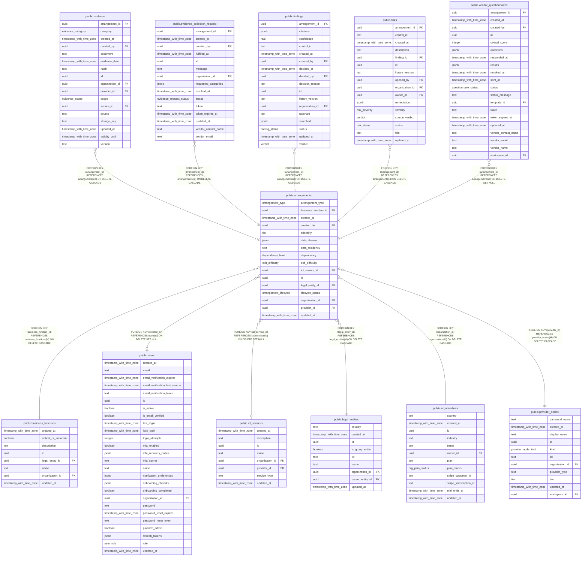

# public.arrangements

## Columns

| Name                 | Type                     | Default                         | Nullable | Children                                                                                                                                                                                                                                                | Parents                                                   | Comment |
| -------------------- | ------------------------ | ------------------------------- | -------- | ------------------------------------------------------------------------------------------------------------------------------------------------------------------------------------------------------------------------------------------------------- | --------------------------------------------------------- | ------- |
| arrangement_type     | arrangement_type         | 'external'::arrangement_type    | false    |                                                                                                                                                                                                                                                         |                                                           |         |
| business_function_id | uuid                     |                                 | false    |                                                                                                                                                                                                                                                         | [public.business_functions](public.business_functions.md) |         |
| created_at           | timestamp with time zone | now()                           | false    |                                                                                                                                                                                                                                                         |                                                           |         |
| created_by           | uuid                     |                                 | true     |                                                                                                                                                                                                                                                         | [public.users](public.users.md)                           |         |
| criticality          | tier                     |                                 | true     |                                                                                                                                                                                                                                                         |                                                           |         |
| data_classes         | jsonb                    | '[]'::jsonb                     | false    |                                                                                                                                                                                                                                                         |                                                           |         |
| data_residency       | text                     | ''::text                        | false    |                                                                                                                                                                                                                                                         |                                                           |         |
| dependency           | dependency_level         |                                 | true     |                                                                                                                                                                                                                                                         |                                                           |         |
| exit_difficulty      | exit_difficulty          |                                 | true     |                                                                                                                                                                                                                                                         |                                                           |         |
| ict_service_id       | uuid                     |                                 | true     |                                                                                                                                                                                                                                                         | [public.ict_services](public.ict_services.md)             |         |
| id                   | uuid                     | gen_random_uuid()               | false    | [public.evidence](public.evidence.md) [public.evidence_collection_request](public.evidence_collection_request.md) [public.findings](public.findings.md) [public.risks](public.risks.md) [public.vendor_questionnaires](public.vendor_questionnaires.md) |                                                           |         |
| legal_entity_id      | uuid                     |                                 | false    |                                                                                                                                                                                                                                                         | [public.legal_entities](public.legal_entities.md)         |         |
| lifecycle_status     | arrangement_lifecycle    | 'active'::arrangement_lifecycle | false    |                                                                                                                                                                                                                                                         |                                                           |         |
| organization_id      | uuid                     |                                 | false    |                                                                                                                                                                                                                                                         | [public.organizations](public.organizations.md)           |         |
| provider_id          | uuid                     |                                 | false    |                                                                                                                                                                                                                                                         | [public.provider_nodes](public.provider_nodes.md)         |         |
| updated_at           | timestamp with time zone | now()                           | false    |                                                                                                                                                                                                                                                         |                                                           |         |

## Constraints

| Name                                                       | Type        | Definition                                                                             |
| ---------------------------------------------------------- | ----------- | -------------------------------------------------------------------------------------- |
| arrangements_business_function_id_business_functions_id_fk | FOREIGN KEY | FOREIGN KEY (business_function_id) REFERENCES business_functions(id) ON DELETE CASCADE |
| arrangements_created_by_users_id_fk                        | FOREIGN KEY | FOREIGN KEY (created_by) REFERENCES users(id) ON DELETE SET NULL                       |
| arrangements_ict_service_id_ict_services_id_fk             | FOREIGN KEY | FOREIGN KEY (ict_service_id) REFERENCES ict_services(id) ON DELETE SET NULL            |
| arrangements_legal_entity_id_legal_entities_id_fk          | FOREIGN KEY | FOREIGN KEY (legal_entity_id) REFERENCES legal_entities(id) ON DELETE CASCADE          |
| arrangements_organization_id_organizations_id_fk           | FOREIGN KEY | FOREIGN KEY (organization_id) REFERENCES organizations(id) ON DELETE CASCADE           |
| arrangements_pkey                                          | PRIMARY KEY | PRIMARY KEY (id)                                                                       |
| arrangements_provider_id_provider_nodes_id_fk              | FOREIGN KEY | FOREIGN KEY (provider_id) REFERENCES provider_nodes(id) ON DELETE CASCADE              |

## Indexes

| Name                       | Definition                                                                                                     |
| -------------------------- | -------------------------------------------------------------------------------------------------------------- |
| arrangements_entity_idx    | CREATE INDEX arrangements_entity_idx ON public.arrangements USING btree (legal_entity_id)                      |
| arrangements_function_idx  | CREATE INDEX arrangements_function_idx ON public.arrangements USING btree (business_function_id)               |
| arrangements_lifecycle_idx | CREATE INDEX arrangements_lifecycle_idx ON public.arrangements USING btree (organization_id, lifecycle_status) |
| arrangements_org_idx       | CREATE INDEX arrangements_org_idx ON public.arrangements USING btree (organization_id)                         |
| arrangements_pkey          | CREATE UNIQUE INDEX arrangements_pkey ON public.arrangements USING btree (id)                                  |
| arrangements_provider_idx  | CREATE INDEX arrangements_provider_idx ON public.arrangements USING btree (provider_id)                        |
| arrangements_service_idx   | CREATE INDEX arrangements_service_idx ON public.arrangements USING btree (ict_service_id)                      |

## Relations

---

> Generated by [tbls](https://github.com/k1LoW/tbls)
