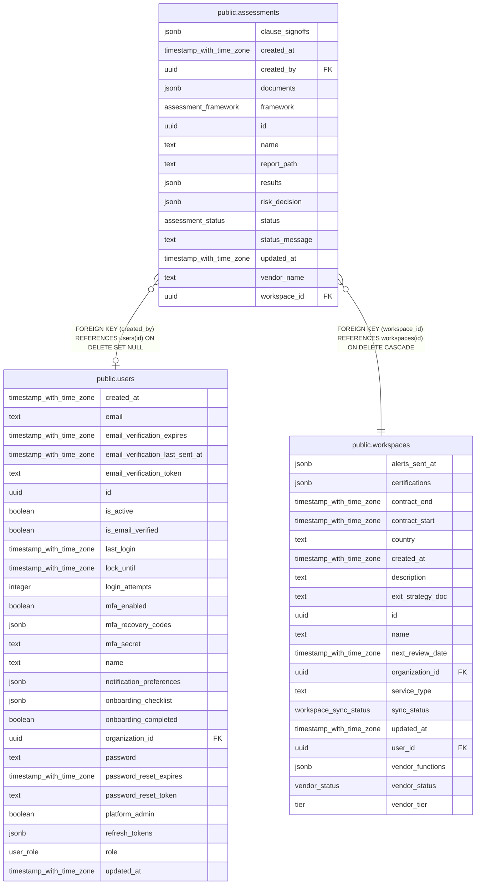

# public.assessments

## Columns

| Name            | Type                     | Default                      | Nullable | Children | Parents                                   | Comment |
| --------------- | ------------------------ | ---------------------------- | -------- | -------- | ----------------------------------------- | ------- |
| clause_signoffs | jsonb                    | '[]'::jsonb                  | false    |          |                                           |         |
| created_at      | timestamp with time zone | now()                        | false    |          |                                           |         |
| created_by      | uuid                     |                              | true     |          | [public.users](public.users.md)           |         |
| documents       | jsonb                    | '[]'::jsonb                  | false    |          |                                           |         |
| framework       | assessment_framework     | 'DORA'::assessment_framework | false    |          |                                           |         |
| id              | uuid                     | gen_random_uuid()            | false    |          |                                           |         |
| name            | text                     |                              | false    |          |                                           |         |
| report_path     | text                     |                              | true     |          |                                           |         |
| results         | jsonb                    |                              | true     |          |                                           |         |
| risk_decision   | jsonb                    |                              | true     |          |                                           |         |
| status          | assessment_status        | 'pending'::assessment_status | false    |          |                                           |         |
| status_message  | text                     | ''::text                     | false    |          |                                           |         |
| updated_at      | timestamp with time zone | now()                        | false    |          |                                           |         |
| vendor_name     | text                     |                              | false    |          |                                           |         |
| workspace_id    | uuid                     |                              | false    |          | [public.workspaces](public.workspaces.md) |         |

## Constraints

| Name                                      | Type        | Definition                                                             |
| ----------------------------------------- | ----------- | ---------------------------------------------------------------------- |
| assessments_created_by_users_id_fk        | FOREIGN KEY | FOREIGN KEY (created_by) REFERENCES users(id) ON DELETE SET NULL       |
| assessments_pkey                          | PRIMARY KEY | PRIMARY KEY (id)                                                       |
| assessments_workspace_id_workspaces_id_fk | FOREIGN KEY | FOREIGN KEY (workspace_id) REFERENCES workspaces(id) ON DELETE CASCADE |

## Indexes

| Name                             | Definition                                                                                                           |
| -------------------------------- | -------------------------------------------------------------------------------------------------------------------- |
| assessments_createdby_status_idx | CREATE INDEX assessments_createdby_status_idx ON public.assessments USING btree (created_by, status)                 |
| assessments_pkey                 | CREATE UNIQUE INDEX assessments_pkey ON public.assessments USING btree (id)                                          |
| assessments_ws_created_idx       | CREATE INDEX assessments_ws_created_idx ON public.assessments USING btree (workspace_id, created_at DESC NULLS LAST) |

## Relations

---

> Generated by [tbls](https://github.com/k1LoW/tbls)
