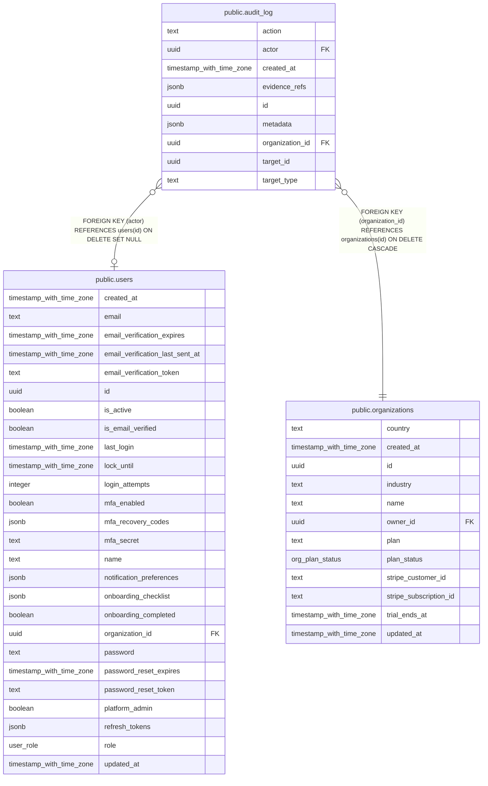

# public.audit_log

## Columns

| Name            | Type                     | Default           | Nullable | Children | Parents                                         | Comment |
| --------------- | ------------------------ | ----------------- | -------- | -------- | ----------------------------------------------- | ------- |
| action          | text                     |                   | false    |          |                                                 |         |
| actor           | uuid                     |                   | true     |          | [public.users](public.users.md)                 |         |
| created_at      | timestamp with time zone | now()             | false    |          |                                                 |         |
| evidence_refs   | jsonb                    | '[]'::jsonb       | false    |          |                                                 |         |
| id              | uuid                     | gen_random_uuid() | false    |          |                                                 |         |
| metadata        | jsonb                    | '{}'::jsonb       | false    |          |                                                 |         |
| organization_id | uuid                     |                   | false    |          | [public.organizations](public.organizations.md) |         |
| target_id       | uuid                     |                   | true     |          |                                                 |         |
| target_type     | text                     |                   | false    |          |                                                 |         |

## Constraints

| Name                                          | Type        | Definition                                                                   |
| --------------------------------------------- | ----------- | ---------------------------------------------------------------------------- |
| audit_log_actor_users_id_fk                   | FOREIGN KEY | FOREIGN KEY (actor) REFERENCES users(id) ON DELETE SET NULL                  |
| audit_log_organization_id_organizations_id_fk | FOREIGN KEY | FOREIGN KEY (organization_id) REFERENCES organizations(id) ON DELETE CASCADE |
| audit_log_pkey                                | PRIMARY KEY | PRIMARY KEY (id)                                                             |

## Indexes

| Name                      | Definition                                                                                                           |
| ------------------------- | -------------------------------------------------------------------------------------------------------------------- |
| audit_log_org_created_idx | CREATE INDEX audit_log_org_created_idx ON public.audit_log USING btree (organization_id, created_at DESC NULLS LAST) |
| audit_log_pkey            | CREATE UNIQUE INDEX audit_log_pkey ON public.audit_log USING btree (id)                                              |
| audit_log_target_idx      | CREATE INDEX audit_log_target_idx ON public.audit_log USING btree (target_type, target_id)                           |

## Triggers

| Name                  | Definition                                                                                                                           |
| --------------------- | ------------------------------------------------------------------------------------------------------------------------------------ |
| audit_log_no_mutation | CREATE TRIGGER audit_log_no_mutation BEFORE DELETE OR UPDATE ON public.audit_log FOR EACH ROW EXECUTE FUNCTION audit_log_immutable() |

## Relations

---

> Generated by [tbls](https://github.com/k1LoW/tbls)
