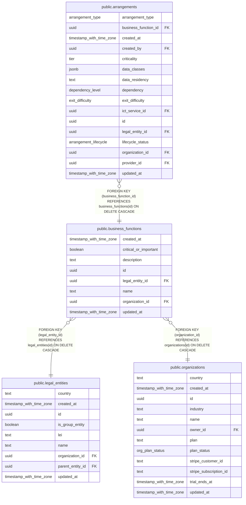

# public.business_functions

## Columns

| Name                  | Type                     | Default           | Nullable | Children                                      | Parents                                           | Comment |
| --------------------- | ------------------------ | ----------------- | -------- | --------------------------------------------- | ------------------------------------------------- | ------- |
| created_at            | timestamp with time zone | now()             | false    |                                               |                                                   |         |
| critical_or_important | boolean                  | false             | false    |                                               |                                                   |         |
| description           | text                     | ''::text          | false    |                                               |                                                   |         |
| id                    | uuid                     | gen_random_uuid() | false    | [public.arrangements](public.arrangements.md) |                                                   |         |
| legal_entity_id       | uuid                     |                   | false    |                                               | [public.legal_entities](public.legal_entities.md) |         |
| name                  | text                     |                   | false    |                                               |                                                   |         |
| organization_id       | uuid                     |                   | false    |                                               | [public.organizations](public.organizations.md)   |         |
| updated_at            | timestamp with time zone | now()             | false    |                                               |                                                   |         |

## Constraints

| Name                                                    | Type        | Definition                                                                    |
| ------------------------------------------------------- | ----------- | ----------------------------------------------------------------------------- |
| business_functions_legal_entity_id_legal_entities_id_fk | FOREIGN KEY | FOREIGN KEY (legal_entity_id) REFERENCES legal_entities(id) ON DELETE CASCADE |
| business_functions_organization_id_organizations_id_fk  | FOREIGN KEY | FOREIGN KEY (organization_id) REFERENCES organizations(id) ON DELETE CASCADE  |
| business_functions_pkey                                 | PRIMARY KEY | PRIMARY KEY (id)                                                              |

## Indexes

| Name                                | Definition                                                                                                               |
| ----------------------------------- | ------------------------------------------------------------------------------------------------------------------------ |
| business_functions_entity_idx       | CREATE INDEX business_functions_entity_idx ON public.business_functions USING btree (legal_entity_id)                    |
| business_functions_entity_name_uniq | CREATE UNIQUE INDEX business_functions_entity_name_uniq ON public.business_functions USING btree (legal_entity_id, name) |
| business_functions_org_idx          | CREATE INDEX business_functions_org_idx ON public.business_functions USING btree (organization_id)                       |
| business_functions_pkey             | CREATE UNIQUE INDEX business_functions_pkey ON public.business_functions USING btree (id)                                |

## Relations

---

> Generated by [tbls](https://github.com/k1LoW/tbls)
