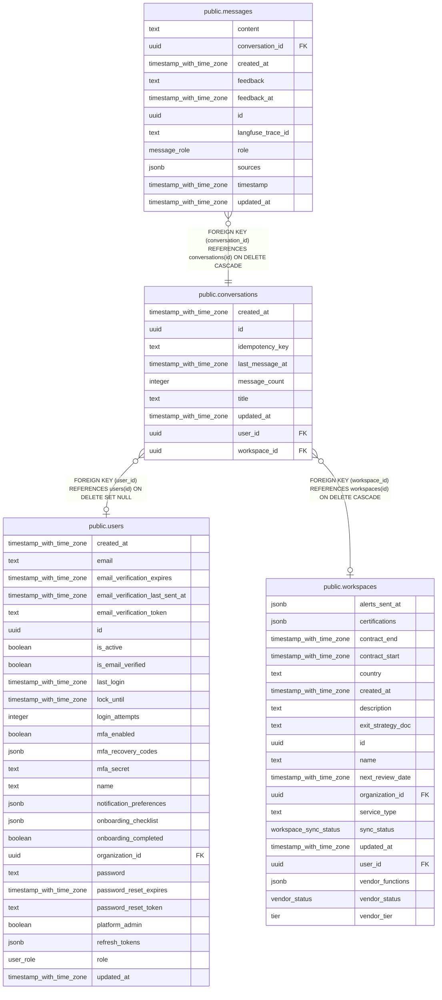

# public.conversations

## Columns

| Name            | Type                     | Default                  | Nullable | Children                              | Parents                                   | Comment |
| --------------- | ------------------------ | ------------------------ | -------- | ------------------------------------- | ----------------------------------------- | ------- |
| created_at      | timestamp with time zone | now()                    | false    |                                       |                                           |         |
| id              | uuid                     | gen_random_uuid()        | false    | [public.messages](public.messages.md) |                                           |         |
| idempotency_key | text                     |                          | true     |                                       |                                           |         |
| last_message_at | timestamp with time zone | now()                    | false    |                                       |                                           |         |
| message_count   | integer                  | 0                        | false    |                                       |                                           |         |
| title           | text                     | 'New Conversation'::text | false    |                                       |                                           |         |
| updated_at      | timestamp with time zone | now()                    | false    |                                       |                                           |         |
| user_id         | uuid                     |                          | true     |                                       | [public.users](public.users.md)           |         |
| workspace_id    | uuid                     |                          | true     |                                       | [public.workspaces](public.workspaces.md) |         |

## Constraints

| Name                                        | Type        | Definition                                                             |
| ------------------------------------------- | ----------- | ---------------------------------------------------------------------- |
| conversations_pkey                          | PRIMARY KEY | PRIMARY KEY (id)                                                       |
| conversations_user_id_users_id_fk           | FOREIGN KEY | FOREIGN KEY (user_id) REFERENCES users(id) ON DELETE SET NULL          |
| conversations_workspace_id_workspaces_id_fk | FOREIGN KEY | FOREIGN KEY (workspace_id) REFERENCES workspaces(id) ON DELETE CASCADE |

## Indexes

| Name                              | Definition                                                                                                                                                          |
| --------------------------------- | ------------------------------------------------------------------------------------------------------------------------------------------------------------------- |
| conversations_idempotency_uniq    | CREATE UNIQUE INDEX conversations_idempotency_uniq ON public.conversations USING btree (user_id, workspace_id, idempotency_key) WHERE (idempotency_key IS NOT NULL) |
| conversations_pkey                | CREATE UNIQUE INDEX conversations_pkey ON public.conversations USING btree (id)                                                                                     |
| conversations_user_updated_idx    | CREATE INDEX conversations_user_updated_idx ON public.conversations USING btree (user_id, updated_at DESC NULLS LAST)                                               |
| conversations_ws_user_updated_idx | CREATE INDEX conversations_ws_user_updated_idx ON public.conversations USING btree (workspace_id, user_id, updated_at DESC NULLS LAST)                              |

## Relations

---

> Generated by [tbls](https://github.com/k1LoW/tbls)
