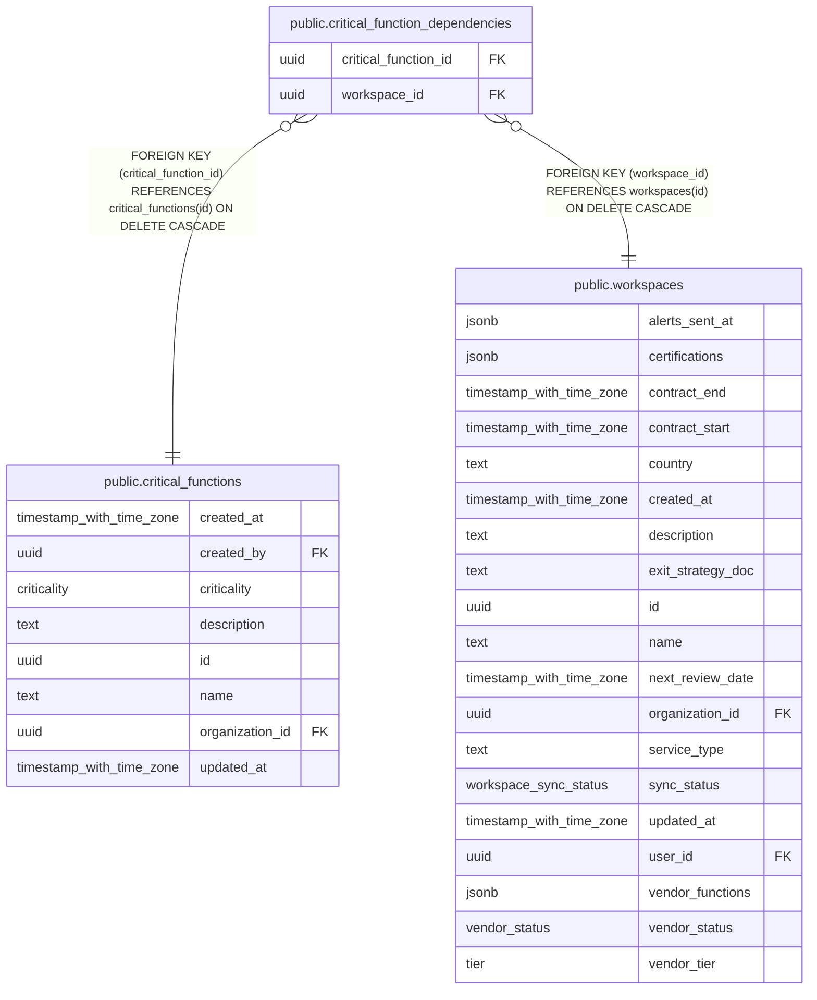

# public.critical_function_dependencies

## Columns

| Name                 | Type | Default | Nullable | Children | Parents                                                   | Comment |
| -------------------- | ---- | ------- | -------- | -------- | --------------------------------------------------------- | ------- |
| critical_function_id | uuid |         | false    |          | [public.critical_functions](public.critical_functions.md) |         |
| workspace_id         | uuid |         | false    |          | [public.workspaces](public.workspaces.md)                 |         |

## Constraints

| Name                                                            | Type        | Definition                                                                             |
| --------------------------------------------------------------- | ----------- | -------------------------------------------------------------------------------------- |
| critical_function_dependencies_critical_function_id_critical_fu | FOREIGN KEY | FOREIGN KEY (critical_function_id) REFERENCES critical_functions(id) ON DELETE CASCADE |
| critical_function_dependencies_critical_function_id_workspace_i | PRIMARY KEY | PRIMARY KEY (critical_function_id, workspace_id)                                       |
| critical_function_dependencies_workspace_id_workspaces_id_fk    | FOREIGN KEY | FOREIGN KEY (workspace_id) REFERENCES workspaces(id) ON DELETE CASCADE                 |

## Indexes

| Name                                                            | Definition                                                                                                                                                                    |
| --------------------------------------------------------------- | ----------------------------------------------------------------------------------------------------------------------------------------------------------------------------- |
| critical_function_dependencies_critical_function_id_workspace_i | CREATE UNIQUE INDEX critical_function_dependencies_critical_function_id_workspace_i ON public.critical_function_dependencies USING btree (critical_function_id, workspace_id) |

## Relations

---

> Generated by [tbls](https://github.com/k1LoW/tbls)
