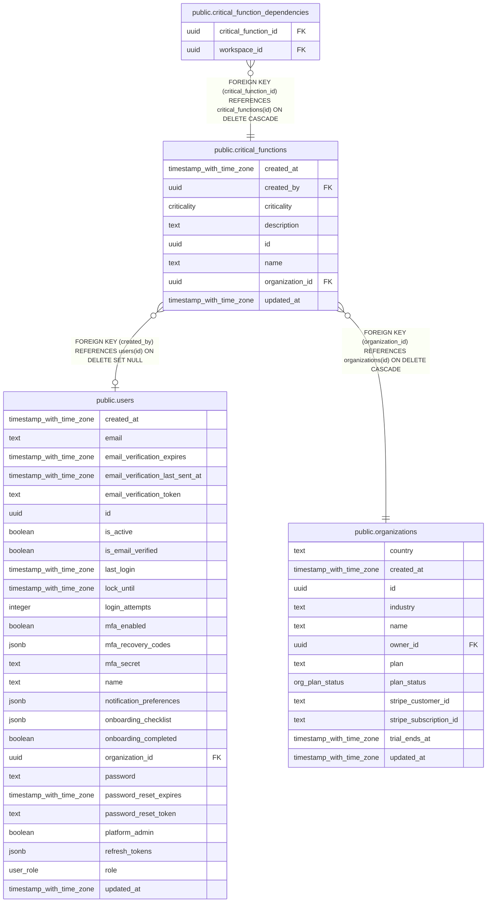

# public.critical_functions

## Columns

| Name            | Type                     | Default           | Nullable | Children                                                                          | Parents                                         | Comment |
| --------------- | ------------------------ | ----------------- | -------- | --------------------------------------------------------------------------------- | ----------------------------------------------- | ------- |
| created_at      | timestamp with time zone | now()             | false    |                                                                                   |                                                 |         |
| created_by      | uuid                     |                   | true     |                                                                                   | [public.users](public.users.md)                 |         |
| criticality     | criticality              |                   | false    |                                                                                   |                                                 |         |
| description     | text                     | ''::text          | false    |                                                                                   |                                                 |         |
| id              | uuid                     | gen_random_uuid() | false    | [public.critical_function_dependencies](public.critical_function_dependencies.md) |                                                 |         |
| name            | text                     |                   | false    |                                                                                   |                                                 |         |
| organization_id | uuid                     |                   | false    |                                                                                   | [public.organizations](public.organizations.md) |         |
| updated_at      | timestamp with time zone | now()             | false    |                                                                                   |                                                 |         |

## Constraints

| Name                                                   | Type        | Definition                                                                   |
| ------------------------------------------------------ | ----------- | ---------------------------------------------------------------------------- |
| critical_functions_created_by_users_id_fk              | FOREIGN KEY | FOREIGN KEY (created_by) REFERENCES users(id) ON DELETE SET NULL             |
| critical_functions_organization_id_organizations_id_fk | FOREIGN KEY | FOREIGN KEY (organization_id) REFERENCES organizations(id) ON DELETE CASCADE |
| critical_functions_pkey                                | PRIMARY KEY | PRIMARY KEY (id)                                                             |

## Indexes

| Name                             | Definition                                                                                                            |
| -------------------------------- | --------------------------------------------------------------------------------------------------------------------- |
| critical_functions_org_name_uniq | CREATE UNIQUE INDEX critical_functions_org_name_uniq ON public.critical_functions USING btree (organization_id, name) |
| critical_functions_pkey          | CREATE UNIQUE INDEX critical_functions_pkey ON public.critical_functions USING btree (id)                             |

## Relations

---

> Generated by [tbls](https://github.com/k1LoW/tbls)
