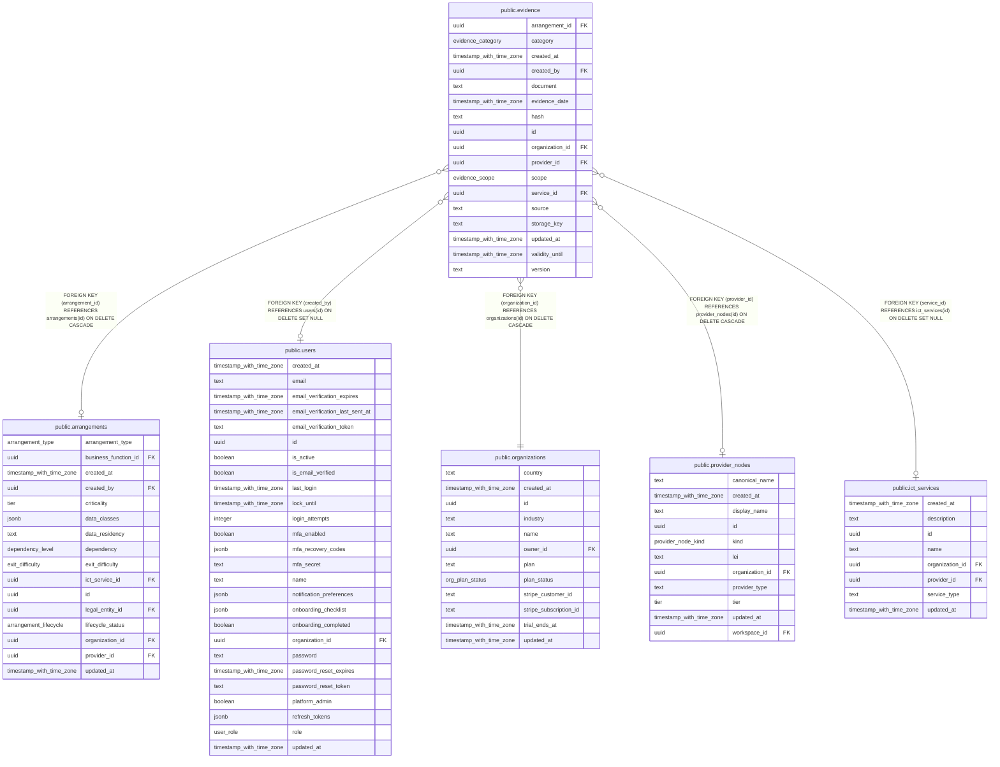

# public.evidence

## Columns

| Name            | Type                     | Default           | Nullable | Children | Parents                                           | Comment |
| --------------- | ------------------------ | ----------------- | -------- | -------- | ------------------------------------------------- | ------- |
| arrangement_id  | uuid                     |                   | true     |          | [public.arrangements](public.arrangements.md)     |         |
| category        | evidence_category        |                   | true     |          |                                                   |         |
| created_at      | timestamp with time zone | now()             | false    |          |                                                   |         |
| created_by      | uuid                     |                   | true     |          | [public.users](public.users.md)                   |         |
| document        | text                     |                   | false    |          |                                                   |         |
| evidence_date   | timestamp with time zone |                   | true     |          |                                                   |         |
| hash            | text                     |                   | false    |          |                                                   |         |
| id              | uuid                     | gen_random_uuid() | false    |          |                                                   |         |
| organization_id | uuid                     |                   | false    |          | [public.organizations](public.organizations.md)   |         |
| provider_id     | uuid                     |                   | true     |          | [public.provider_nodes](public.provider_nodes.md) |         |
| scope           | evidence_scope           |                   | false    |          |                                                   |         |
| service_id      | uuid                     |                   | true     |          | [public.ict_services](public.ict_services.md)     |         |
| source          | text                     | ''::text          | false    |          |                                                   |         |
| storage_key     | text                     |                   | true     |          |                                                   |         |
| updated_at      | timestamp with time zone | now()             | false    |          |                                                   |         |
| validity_until  | timestamp with time zone |                   | true     |          |                                                   |         |
| version         | text                     | ''::text          | false    |          |                                                   |         |

## Constraints

| Name                                         | Type        | Definition                                                                                                                                                                                                          |
| -------------------------------------------- | ----------- | ------------------------------------------------------------------------------------------------------------------------------------------------------------------------------------------------------------------- |
| evidence_arrangement_id_arrangements_id_fk   | FOREIGN KEY | FOREIGN KEY (arrangement_id) REFERENCES arrangements(id) ON DELETE CASCADE                                                                                                                                          |
| evidence_created_by_users_id_fk              | FOREIGN KEY | FOREIGN KEY (created_by) REFERENCES users(id) ON DELETE SET NULL                                                                                                                                                    |
| evidence_organization_id_organizations_id_fk | FOREIGN KEY | FOREIGN KEY (organization_id) REFERENCES organizations(id) ON DELETE CASCADE                                                                                                                                        |
| evidence_pkey                                | PRIMARY KEY | PRIMARY KEY (id)                                                                                                                                                                                                    |
| evidence_provider_id_provider_nodes_id_fk    | FOREIGN KEY | FOREIGN KEY (provider_id) REFERENCES provider_nodes(id) ON DELETE CASCADE                                                                                                                                           |
| evidence_scope_target_check                  | CHECK       | CHECK ((((scope = 'provider'::evidence_scope) AND (provider_id IS NOT NULL) AND (arrangement_id IS NULL)) OR ((scope = 'arrangement'::evidence_scope) AND (arrangement_id IS NOT NULL) AND (provider_id IS NULL)))) |
| evidence_service_id_ict_services_id_fk       | FOREIGN KEY | FOREIGN KEY (service_id) REFERENCES ict_services(id) ON DELETE SET NULL                                                                                                                                             |

## Indexes

| Name                     | Definition                                                                                |
| ------------------------ | ----------------------------------------------------------------------------------------- |
| evidence_arrangement_idx | CREATE INDEX evidence_arrangement_idx ON public.evidence USING btree (arrangement_id)     |
| evidence_org_hash_idx    | CREATE INDEX evidence_org_hash_idx ON public.evidence USING btree (organization_id, hash) |
| evidence_org_idx         | CREATE INDEX evidence_org_idx ON public.evidence USING btree (organization_id)            |
| evidence_pkey            | CREATE UNIQUE INDEX evidence_pkey ON public.evidence USING btree (id)                     |
| evidence_provider_idx    | CREATE INDEX evidence_provider_idx ON public.evidence USING btree (provider_id)           |

## Relations

---

> Generated by [tbls](https://github.com/k1LoW/tbls)
