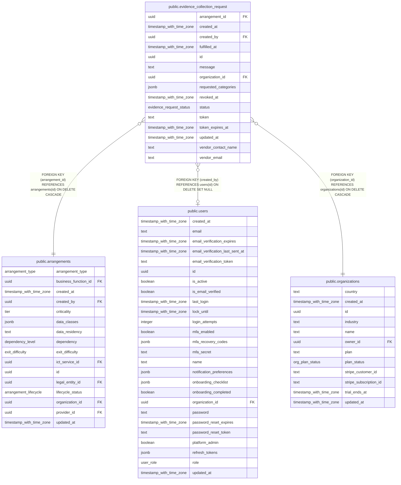

# public.evidence_collection_request

## Columns

| Name                 | Type                     | Default                            | Nullable | Children | Parents                                         | Comment |
| -------------------- | ------------------------ | ---------------------------------- | -------- | -------- | ----------------------------------------------- | ------- |
| arrangement_id       | uuid                     |                                    | false    |          | [public.arrangements](public.arrangements.md)   |         |
| created_at           | timestamp with time zone | now()                              | false    |          |                                                 |         |
| created_by           | uuid                     |                                    | true     |          | [public.users](public.users.md)                 |         |
| fulfilled_at         | timestamp with time zone |                                    | true     |          |                                                 |         |
| id                   | uuid                     | gen_random_uuid()                  | false    |          |                                                 |         |
| message              | text                     | ''::text                           | false    |          |                                                 |         |
| organization_id      | uuid                     |                                    | false    |          | [public.organizations](public.organizations.md) |         |
| requested_categories | jsonb                    | '[]'::jsonb                        | false    |          |                                                 |         |
| revoked_at           | timestamp with time zone |                                    | true     |          |                                                 |         |
| status               | evidence_request_status  | 'pending'::evidence_request_status | false    |          |                                                 |         |
| token                | text                     |                                    | true     |          |                                                 |         |
| token_expires_at     | timestamp with time zone |                                    | true     |          |                                                 |         |
| updated_at           | timestamp with time zone | now()                              | false    |          |                                                 |         |
| vendor_contact_name  | text                     | ''::text                           | false    |          |                                                 |         |
| vendor_email         | text                     |                                    | false    |          |                                                 |         |

## Constraints

| Name                                                            | Type        | Definition                                                                   |
| --------------------------------------------------------------- | ----------- | ---------------------------------------------------------------------------- |
| evidence_collection_request_arrangement_id_arrangements_id_fk   | FOREIGN KEY | FOREIGN KEY (arrangement_id) REFERENCES arrangements(id) ON DELETE CASCADE   |
| evidence_collection_request_created_by_users_id_fk              | FOREIGN KEY | FOREIGN KEY (created_by) REFERENCES users(id) ON DELETE SET NULL             |
| evidence_collection_request_organization_id_organizations_id_fk | FOREIGN KEY | FOREIGN KEY (organization_id) REFERENCES organizations(id) ON DELETE CASCADE |
| evidence_collection_request_pkey                                | PRIMARY KEY | PRIMARY KEY (id)                                                             |

## Indexes

| Name                                      | Definition                                                                                                                                            |
| ----------------------------------------- | ----------------------------------------------------------------------------------------------------------------------------------------------------- |
| evidence_collection_request_pkey          | CREATE UNIQUE INDEX evidence_collection_request_pkey ON public.evidence_collection_request USING btree (id)                                           |
| evidence_requests_arrangement_created_idx | CREATE INDEX evidence_requests_arrangement_created_idx ON public.evidence_collection_request USING btree (arrangement_id, created_at DESC NULLS LAST) |
| evidence_requests_org_arrangement_idx     | CREATE INDEX evidence_requests_org_arrangement_idx ON public.evidence_collection_request USING btree (organization_id, arrangement_id)                |
| evidence_requests_token_uniq              | CREATE UNIQUE INDEX evidence_requests_token_uniq ON public.evidence_collection_request USING btree (token) WHERE (token IS NOT NULL)                  |

## Relations

---

> Generated by [tbls](https://github.com/k1LoW/tbls)
