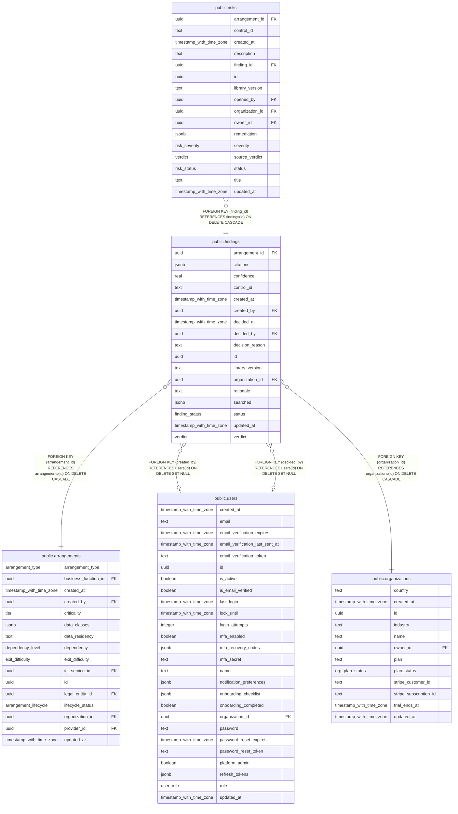

# public.findings

## Columns

| Name            | Type                     | Default                 | Nullable | Children                        | Parents                                         | Comment |
| --------------- | ------------------------ | ----------------------- | -------- | ------------------------------- | ----------------------------------------------- | ------- |
| arrangement_id  | uuid                     |                         | false    |                                 | [public.arrangements](public.arrangements.md)   |         |
| citations       | jsonb                    | '[]'::jsonb             | false    |                                 |                                                 |         |
| confidence      | real                     |                         | true     |                                 |                                                 |         |
| control_id      | text                     |                         | false    |                                 |                                                 |         |
| created_at      | timestamp with time zone | now()                   | false    |                                 |                                                 |         |
| created_by      | uuid                     |                         | true     |                                 | [public.users](public.users.md)                 |         |
| decided_at      | timestamp with time zone |                         | true     |                                 |                                                 |         |
| decided_by      | uuid                     |                         | true     |                                 | [public.users](public.users.md)                 |         |
| decision_reason | text                     |                         | true     |                                 |                                                 |         |
| id              | uuid                     | gen_random_uuid()       | false    | [public.risks](public.risks.md) |                                                 |         |
| library_version | text                     |                         | false    |                                 |                                                 |         |
| organization_id | uuid                     |                         | false    |                                 | [public.organizations](public.organizations.md) |         |
| rationale       | text                     | ''::text                | false    |                                 |                                                 |         |
| searched        | jsonb                    | '[]'::jsonb             | false    |                                 |                                                 |         |
| status          | finding_status           | 'draft'::finding_status | false    |                                 |                                                 |         |
| updated_at      | timestamp with time zone | now()                   | false    |                                 |                                                 |         |
| verdict         | verdict                  |                         | false    |                                 |                                                 |         |

## Constraints

| Name                                         | Type        | Definition                                                                   |
| -------------------------------------------- | ----------- | ---------------------------------------------------------------------------- |
| findings_arrangement_id_arrangements_id_fk   | FOREIGN KEY | FOREIGN KEY (arrangement_id) REFERENCES arrangements(id) ON DELETE CASCADE   |
| findings_created_by_users_id_fk              | FOREIGN KEY | FOREIGN KEY (created_by) REFERENCES users(id) ON DELETE SET NULL             |
| findings_decided_by_users_id_fk              | FOREIGN KEY | FOREIGN KEY (decided_by) REFERENCES users(id) ON DELETE SET NULL             |
| findings_organization_id_organizations_id_fk | FOREIGN KEY | FOREIGN KEY (organization_id) REFERENCES organizations(id) ON DELETE CASCADE |
| findings_pkey                                | PRIMARY KEY | PRIMARY KEY (id)                                                             |

## Indexes

| Name                              | Definition                                                                                                                         |
| --------------------------------- | ---------------------------------------------------------------------------------------------------------------------------------- |
| findings_arrangement_control_uniq | CREATE UNIQUE INDEX findings_arrangement_control_uniq ON public.findings USING btree (organization_id, arrangement_id, control_id) |
| findings_arrangement_idx          | CREATE INDEX findings_arrangement_idx ON public.findings USING btree (arrangement_id)                                              |
| findings_org_idx                  | CREATE INDEX findings_org_idx ON public.findings USING btree (organization_id)                                                     |
| findings_pkey                     | CREATE UNIQUE INDEX findings_pkey ON public.findings USING btree (id)                                                              |

## Relations

---

> Generated by [tbls](https://github.com/k1LoW/tbls)
