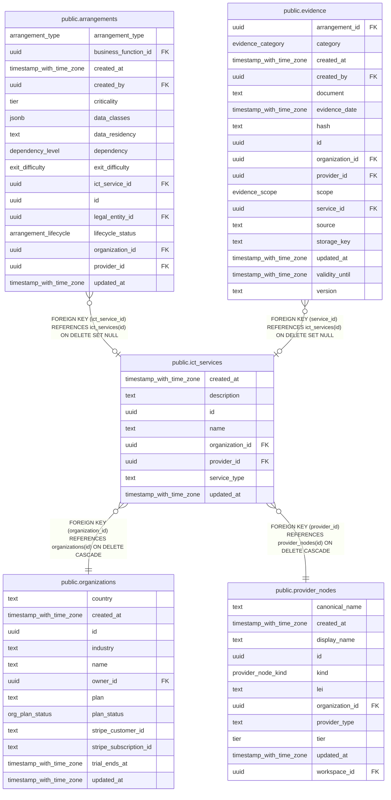

# public.ict_services

## Columns

| Name            | Type                     | Default           | Nullable | Children                                                                            | Parents                                           | Comment |
| --------------- | ------------------------ | ----------------- | -------- | ----------------------------------------------------------------------------------- | ------------------------------------------------- | ------- |
| created_at      | timestamp with time zone | now()             | false    |                                                                                     |                                                   |         |
| description     | text                     | ''::text          | false    |                                                                                     |                                                   |         |
| id              | uuid                     | gen_random_uuid() | false    | [public.arrangements](public.arrangements.md) [public.evidence](public.evidence.md) |                                                   |         |
| name            | text                     |                   | false    |                                                                                     |                                                   |         |
| organization_id | uuid                     |                   | false    |                                                                                     | [public.organizations](public.organizations.md)   |         |
| provider_id     | uuid                     |                   | false    |                                                                                     | [public.provider_nodes](public.provider_nodes.md) |         |
| service_type    | text                     |                   | true     |                                                                                     |                                                   |         |
| updated_at      | timestamp with time zone | now()             | false    |                                                                                     |                                                   |         |

## Constraints

| Name                                             | Type        | Definition                                                                                                                                      |
| ------------------------------------------------ | ----------- | ----------------------------------------------------------------------------------------------------------------------------------------------- |
| ict_services_organization_id_organizations_id_fk | FOREIGN KEY | FOREIGN KEY (organization_id) REFERENCES organizations(id) ON DELETE CASCADE                                                                    |
| ict_services_pkey                                | PRIMARY KEY | PRIMARY KEY (id)                                                                                                                                |
| ict_services_provider_id_provider_nodes_id_fk    | FOREIGN KEY | FOREIGN KEY (provider_id) REFERENCES provider_nodes(id) ON DELETE CASCADE                                                                       |
| ict_services_service_type_check                  | CHECK       | CHECK (((service_type IS NULL) OR (service_type = ANY (ARRAY['cloud'::text, 'software'::text, 'data'::text, 'network'::text, 'other'::text])))) |

## Indexes

| Name                      | Definition                                                                              |
| ------------------------- | --------------------------------------------------------------------------------------- |
| ict_services_org_idx      | CREATE INDEX ict_services_org_idx ON public.ict_services USING btree (organization_id)  |
| ict_services_pkey         | CREATE UNIQUE INDEX ict_services_pkey ON public.ict_services USING btree (id)           |
| ict_services_provider_idx | CREATE INDEX ict_services_provider_idx ON public.ict_services USING btree (provider_id) |

## Relations

---

> Generated by [tbls](https://github.com/k1LoW/tbls)
