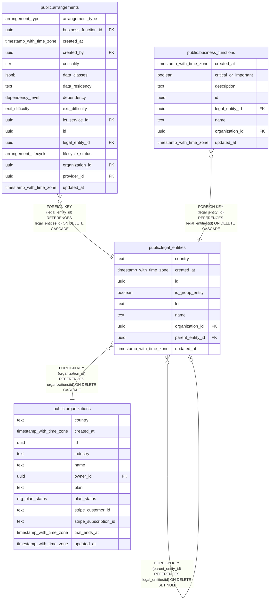

# public.legal_entities

## Columns

| Name             | Type                     | Default           | Nullable | Children                                                                                                                                                  | Parents                                           | Comment |
| ---------------- | ------------------------ | ----------------- | -------- | --------------------------------------------------------------------------------------------------------------------------------------------------------- | ------------------------------------------------- | ------- |
| country          | text                     | ''::text          | false    |                                                                                                                                                           |                                                   |         |
| created_at       | timestamp with time zone | now()             | false    |                                                                                                                                                           |                                                   |         |
| id               | uuid                     | gen_random_uuid() | false    | [public.arrangements](public.arrangements.md) [public.business_functions](public.business_functions.md) [public.legal_entities](public.legal_entities.md) |                                                   |         |
| is_group_entity  | boolean                  | false             | false    |                                                                                                                                                           |                                                   |         |
| lei              | text                     |                   | true     |                                                                                                                                                           |                                                   |         |
| name             | text                     |                   | false    |                                                                                                                                                           |                                                   |         |
| organization_id  | uuid                     |                   | false    |                                                                                                                                                           | [public.organizations](public.organizations.md)   |         |
| parent_entity_id | uuid                     |                   | true     |                                                                                                                                                           | [public.legal_entities](public.legal_entities.md) |         |
| updated_at       | timestamp with time zone | now()             | false    |                                                                                                                                                           |                                                   |         |

## Constraints

| Name                                                 | Type        | Definition                                                                      |
| ---------------------------------------------------- | ----------- | ------------------------------------------------------------------------------- |
| legal_entities_organization_id_organizations_id_fk   | FOREIGN KEY | FOREIGN KEY (organization_id) REFERENCES organizations(id) ON DELETE CASCADE    |
| legal_entities_parent_entity_id_legal_entities_id_fk | FOREIGN KEY | FOREIGN KEY (parent_entity_id) REFERENCES legal_entities(id) ON DELETE SET NULL |
| legal_entities_pkey                                  | PRIMARY KEY | PRIMARY KEY (id)                                                                |

## Indexes

| Name                         | Definition                                                                                                    |
| ---------------------------- | ------------------------------------------------------------------------------------------------------------- |
| legal_entities_org_idx       | CREATE INDEX legal_entities_org_idx ON public.legal_entities USING btree (organization_id)                    |
| legal_entities_org_name_uniq | CREATE UNIQUE INDEX legal_entities_org_name_uniq ON public.legal_entities USING btree (organization_id, name) |
| legal_entities_parent_idx    | CREATE INDEX legal_entities_parent_idx ON public.legal_entities USING btree (parent_entity_id)                |
| legal_entities_pkey          | CREATE UNIQUE INDEX legal_entities_pkey ON public.legal_entities USING btree (id)                             |

## Relations

---

> Generated by [tbls](https://github.com/k1LoW/tbls)
