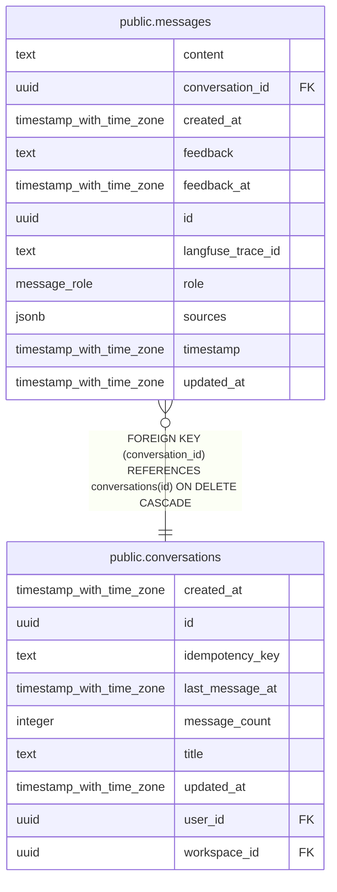

# public.messages

## Columns

| Name              | Type                     | Default           | Nullable | Children | Parents                                         | Comment |
| ----------------- | ------------------------ | ----------------- | -------- | -------- | ----------------------------------------------- | ------- |
| content           | text                     |                   | false    |          |                                                 |         |
| conversation_id   | uuid                     |                   | false    |          | [public.conversations](public.conversations.md) |         |
| created_at        | timestamp with time zone | now()             | false    |          |                                                 |         |
| feedback          | text                     |                   | true     |          |                                                 |         |
| feedback_at       | timestamp with time zone |                   | true     |          |                                                 |         |
| id                | uuid                     | gen_random_uuid() | false    |          |                                                 |         |
| langfuse_trace_id | text                     |                   | true     |          |                                                 |         |
| role              | message_role             |                   | false    |          |                                                 |         |
| sources           | jsonb                    | '[]'::jsonb       | false    |          |                                                 |         |
| timestamp         | timestamp with time zone | now()             | false    |          |                                                 |         |
| updated_at        | timestamp with time zone | now()             | false    |          |                                                 |         |

## Constraints

| Name                                         | Type        | Definition                                                                   |
| -------------------------------------------- | ----------- | ---------------------------------------------------------------------------- |
| messages_conversation_id_conversations_id_fk | FOREIGN KEY | FOREIGN KEY (conversation_id) REFERENCES conversations(id) ON DELETE CASCADE |
| messages_pkey                                | PRIMARY KEY | PRIMARY KEY (id)                                                             |

## Indexes

| Name                                | Definition                                                                                                     |
| ----------------------------------- | -------------------------------------------------------------------------------------------------------------- |
| messages_conversation_timestamp_idx | CREATE INDEX messages_conversation_timestamp_idx ON public.messages USING btree (conversation_id, "timestamp") |
| messages_pkey                       | CREATE UNIQUE INDEX messages_pkey ON public.messages USING btree (id)                                          |

## Relations

---

> Generated by [tbls](https://github.com/k1LoW/tbls)
