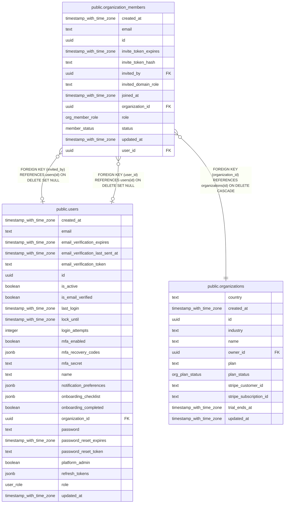

# public.organization_members

## Columns

| Name                 | Type                     | Default                    | Nullable | Children | Parents                                         | Comment |
| -------------------- | ------------------------ | -------------------------- | -------- | -------- | ----------------------------------------------- | ------- |
| created_at           | timestamp with time zone | now()                      | false    |          |                                                 |         |
| email                | text                     |                            | false    |          |                                                 |         |
| id                   | uuid                     | gen_random_uuid()          | false    |          |                                                 |         |
| invite_token_expires | timestamp with time zone |                            | true     |          |                                                 |         |
| invite_token_hash    | text                     |                            | true     |          |                                                 |         |
| invited_by           | uuid                     |                            | true     |          | [public.users](public.users.md)                 |         |
| invited_domain_role  | text                     |                            | true     |          |                                                 |         |
| joined_at            | timestamp with time zone |                            | true     |          |                                                 |         |
| organization_id      | uuid                     |                            | false    |          | [public.organizations](public.organizations.md) |         |
| role                 | org_member_role          | 'analyst'::org_member_role | false    |          |                                                 |         |
| status               | member_status            | 'pending'::member_status   | false    |          |                                                 |         |
| updated_at           | timestamp with time zone | now()                      | false    |          |                                                 |         |
| user_id              | uuid                     |                            | true     |          | [public.users](public.users.md)                 |         |

## Constraints

| Name                                                     | Type        | Definition                                                                   |
| -------------------------------------------------------- | ----------- | ---------------------------------------------------------------------------- |
| organization_members_invited_by_users_id_fk              | FOREIGN KEY | FOREIGN KEY (invited_by) REFERENCES users(id) ON DELETE SET NULL             |
| organization_members_organization_id_organizations_id_fk | FOREIGN KEY | FOREIGN KEY (organization_id) REFERENCES organizations(id) ON DELETE CASCADE |
| organization_members_pkey                                | PRIMARY KEY | PRIMARY KEY (id)                                                             |
| organization_members_user_id_users_id_fk                 | FOREIGN KEY | FOREIGN KEY (user_id) REFERENCES users(id) ON DELETE SET NULL                |

## Indexes

| Name                       | Definition                                                                                                         |
| -------------------------- | ------------------------------------------------------------------------------------------------------------------ |
| org_members_org_email_uniq | CREATE UNIQUE INDEX org_members_org_email_uniq ON public.organization_members USING btree (organization_id, email) |
| org_members_user_id_idx    | CREATE INDEX org_members_user_id_idx ON public.organization_members USING btree (user_id)                          |
| organization_members_pkey  | CREATE UNIQUE INDEX organization_members_pkey ON public.organization_members USING btree (id)                      |

## Relations

---

> Generated by [tbls](https://github.com/k1LoW/tbls)
