# public.organizations

## Columns

| Name                   | Type                     | Default                     | Nullable | Children                                                                                                                                                                                                                                                                                                                                                                                                                                                                                                                                                                                                                                                                                                                                                    | Parents                         | Comment |
| ---------------------- | ------------------------ | --------------------------- | -------- | ----------------------------------------------------------------------------------------------------------------------------------------------------------------------------------------------------------------------------------------------------------------------------------------------------------------------------------------------------------------------------------------------------------------------------------------------------------------------------------------------------------------------------------------------------------------------------------------------------------------------------------------------------------------------------------------------------------------------------------------------------------- | ------------------------------- | ------- |
| country                | text                     | ''::text                    | false    |                                                                                                                                                                                                                                                                                                                                                                                                                                                                                                                                                                                                                                                                                                                                                             |                                 |         |
| created_at             | timestamp with time zone | now()                       | false    |                                                                                                                                                                                                                                                                                                                                                                                                                                                                                                                                                                                                                                                                                                                                                             |                                 |         |
| id                     | uuid                     | gen_random_uuid()           | false    | [public.arrangements](public.arrangements.md) [public.audit_log](public.audit_log.md) [public.business_functions](public.business_functions.md) [public.critical_functions](public.critical_functions.md) [public.evidence](public.evidence.md) [public.evidence_collection_request](public.evidence_collection_request.md) [public.findings](public.findings.md) [public.ict_services](public.ict_services.md) [public.legal_entities](public.legal_entities.md) [public.organization_members](public.organization_members.md) [public.provider_dependencies](public.provider_dependencies.md) [public.provider_nodes](public.provider_nodes.md) [public.risks](public.risks.md) [public.users](public.users.md) [public.workspaces](public.workspaces.md) |                                 |         |
| industry               | text                     | 'other'::text               | false    |                                                                                                                                                                                                                                                                                                                                                                                                                                                                                                                                                                                                                                                                                                                                                             |                                 |         |
| name                   | text                     |                             | false    |                                                                                                                                                                                                                                                                                                                                                                                                                                                                                                                                                                                                                                                                                                                                                             |                                 |         |
| owner_id               | uuid                     |                             | false    |                                                                                                                                                                                                                                                                                                                                                                                                                                                                                                                                                                                                                                                                                                                                                             | [public.users](public.users.md) |         |
| plan                   | text                     | 'starter'::text             | false    |                                                                                                                                                                                                                                                                                                                                                                                                                                                                                                                                                                                                                                                                                                                                                             |                                 |         |
| plan_status            | org_plan_status          | 'trialing'::org_plan_status | false    |                                                                                                                                                                                                                                                                                                                                                                                                                                                                                                                                                                                                                                                                                                                                                             |                                 |         |
| stripe_customer_id     | text                     |                             | true     |                                                                                                                                                                                                                                                                                                                                                                                                                                                                                                                                                                                                                                                                                                                                                             |                                 |         |
| stripe_subscription_id | text                     |                             | true     |                                                                                                                                                                                                                                                                                                                                                                                                                                                                                                                                                                                                                                                                                                                                                             |                                 |         |
| trial_ends_at          | timestamp with time zone |                             | true     |                                                                                                                                                                                                                                                                                                                                                                                                                                                                                                                                                                                                                                                                                                                                                             |                                 |         |
| updated_at             | timestamp with time zone | now()                       | false    |                                                                                                                                                                                                                                                                                                                                                                                                                                                                                                                                                                                                                                                                                                                                                             |                                 |         |

## Constraints

| Name                               | Type        | Definition                                                                                                                |
| ---------------------------------- | ----------- | ------------------------------------------------------------------------------------------------------------------------- |
| organizations_industry_check       | CHECK       | CHECK ((industry = ANY (ARRAY['insurance'::text, 'banking'::text, 'investment'::text, 'payments'::text, 'other'::text]))) |
| organizations_owner_id_users_id_fk | FOREIGN KEY | FOREIGN KEY (owner_id) REFERENCES users(id)                                                                               |
| organizations_pkey                 | PRIMARY KEY | PRIMARY KEY (id)                                                                                                          |
| organizations_plan_check           | CHECK       | CHECK ((plan = ANY (ARRAY['starter'::text, 'professional'::text, 'business'::text, 'enterprise'::text])))                 |

## Indexes

| Name               | Definition                                                                      |
| ------------------ | ------------------------------------------------------------------------------- |
| organizations_pkey | CREATE UNIQUE INDEX organizations_pkey ON public.organizations USING btree (id) |

## Relations

```mermaid
erDiagram

"public.arrangements" }o--|| "public.organizations" : "FOREIGN KEY (organization_id) REFERENCES organizations(id) ON DELETE CASCADE"
"public.audit_log" }o--|| "public.organizations" : "FOREIGN KEY (organization_id) REFERENCES organizations(id) ON DELETE CASCADE"
"public.business_functions" }o--|| "public.organizations" : "FOREIGN KEY (organization_id) REFERENCES organizations(id) ON DELETE CASCADE"
"public.critical_functions" }o--|| "public.organizations" : "FOREIGN KEY (organization_id) REFERENCES organizations(id) ON DELETE CASCADE"
"public.evidence" }o--|| "public.organizations" : "FOREIGN KEY (organization_id) REFERENCES organizations(id) ON DELETE CASCADE"
"public.evidence_collection_request" }o--|| "public.organizations" : "FOREIGN KEY (organization_id) REFERENCES organizations(id) ON DELETE CASCADE"
"public.findings" }o--|| "public.organizations" : "FOREIGN KEY (organization_id) REFERENCES organizations(id) ON DELETE CASCADE"
"public.ict_services" }o--|| "public.organizations" : "FOREIGN KEY (organization_id) REFERENCES organizations(id) ON DELETE CASCADE"
"public.legal_entities" }o--|| "public.organizations" : "FOREIGN KEY (organization_id) REFERENCES organizations(id) ON DELETE CASCADE"
"public.organization_members" }o--|| "public.organizations" : "FOREIGN KEY (organization_id) REFERENCES organizations(id) ON DELETE CASCADE"
"public.provider_dependencies" }o--|| "public.organizations" : "FOREIGN KEY (organization_id) REFERENCES organizations(id) ON DELETE CASCADE"
"public.provider_nodes" }o--|| "public.organizations" : "FOREIGN KEY (organization_id) REFERENCES organizations(id) ON DELETE CASCADE"
"public.risks" }o--|| "public.organizations" : "FOREIGN KEY (organization_id) REFERENCES organizations(id) ON DELETE CASCADE"
"public.users" }o--o| "public.organizations" : "FOREIGN KEY (organization_id) REFERENCES organizations(id) ON DELETE SET NULL"
"public.workspaces" }o--o| "public.organizations" : "FOREIGN KEY (organization_id) REFERENCES organizations(id) ON DELETE SET NULL"
"public.organizations" }o--|| "public.users" : "FOREIGN KEY (owner_id) REFERENCES users(id)"

"public.organizations" {
  text country
  timestamp_with_time_zone created_at
  uuid id
  text industry
  text name
  uuid owner_id FK
  text plan
  org_plan_status plan_status
  text stripe_customer_id
  text stripe_subscription_id
  timestamp_with_time_zone trial_ends_at
  timestamp_with_time_zone updated_at
}
"public.arrangements" {
  arrangement_type arrangement_type
  uuid business_function_id FK
  timestamp_with_time_zone created_at
  uuid created_by FK
  tier criticality
  jsonb data_classes
  text data_residency
  dependency_level dependency
  exit_difficulty exit_difficulty
  uuid ict_service_id FK
  uuid id
  uuid legal_entity_id FK
  arrangement_lifecycle lifecycle_status
  uuid organization_id FK
  uuid provider_id FK
  timestamp_with_time_zone updated_at
}
"public.audit_log" {
  text action
  uuid actor FK
  timestamp_with_time_zone created_at
  jsonb evidence_refs
  uuid id
  jsonb metadata
  uuid organization_id FK
  uuid target_id
  text target_type
}
"public.business_functions" {
  timestamp_with_time_zone created_at
  boolean critical_or_important
  text description
  uuid id
  uuid legal_entity_id FK
  text name
  uuid organization_id FK
  timestamp_with_time_zone updated_at
}
"public.critical_functions" {
  timestamp_with_time_zone created_at
  uuid created_by FK
  criticality criticality
  text description
  uuid id
  text name
  uuid organization_id FK
  timestamp_with_time_zone updated_at
}
"public.evidence" {
  uuid arrangement_id FK
  evidence_category category
  timestamp_with_time_zone created_at
  uuid created_by FK
  text document
  timestamp_with_time_zone evidence_date
  text hash
  uuid id
  uuid organization_id FK
  uuid provider_id FK
  evidence_scope scope
  uuid service_id FK
  text source
  text storage_key
  timestamp_with_time_zone updated_at
  timestamp_with_time_zone validity_until
  text version
}
"public.evidence_collection_request" {
  uuid arrangement_id FK
  timestamp_with_time_zone created_at
  uuid created_by FK
  timestamp_with_time_zone fulfilled_at
  uuid id
  text message
  uuid organization_id FK
  jsonb requested_categories
  timestamp_with_time_zone revoked_at
  evidence_request_status status
  text token
  timestamp_with_time_zone token_expires_at
  timestamp_with_time_zone updated_at
  text vendor_contact_name
  text vendor_email
}
"public.findings" {
  uuid arrangement_id FK
  jsonb citations
  real confidence
  text control_id
  timestamp_with_time_zone created_at
  uuid created_by FK
  timestamp_with_time_zone decided_at
  uuid decided_by FK
  text decision_reason
  uuid id
  text library_version
  uuid organization_id FK
  text rationale
  jsonb searched
  finding_status status
  timestamp_with_time_zone updated_at
  verdict verdict
}
"public.ict_services" {
  timestamp_with_time_zone created_at
  text description
  uuid id
  text name
  uuid organization_id FK
  uuid provider_id FK
  text service_type
  timestamp_with_time_zone updated_at
}
"public.legal_entities" {
  text country
  timestamp_with_time_zone created_at
  uuid id
  boolean is_group_entity
  text lei
  text name
  uuid organization_id FK
  uuid parent_entity_id FK
  timestamp_with_time_zone updated_at
}
"public.organization_members" {
  timestamp_with_time_zone created_at
  text email
  uuid id
  timestamp_with_time_zone invite_token_expires
  text invite_token_hash
  uuid invited_by FK
  text invited_domain_role
  timestamp_with_time_zone joined_at
  uuid organization_id FK
  org_member_role role
  member_status status
  timestamp_with_time_zone updated_at
  uuid user_id FK
}
"public.provider_dependencies" {
  uuid child_node_id FK
  real confidence
  boolean confirmed
  timestamp_with_time_zone created_at
  uuid created_by FK
  uuid id
  timestamp_with_time_zone last_verified_at
  uuid organization_id FK
  uuid parent_node_id FK
  text relationship
  provider_source source
  timestamp_with_time_zone updated_at
}
"public.provider_nodes" {
  text canonical_name
  timestamp_with_time_zone created_at
  text display_name
  uuid id
  provider_node_kind kind
  text lei
  uuid organization_id FK
  text provider_type
  tier tier
  timestamp_with_time_zone updated_at
  uuid workspace_id FK
}
"public.risks" {
  uuid arrangement_id FK
  text control_id
  timestamp_with_time_zone created_at
  text description
  uuid finding_id FK
  uuid id
  text library_version
  uuid opened_by FK
  uuid organization_id FK
  uuid owner_id FK
  jsonb remediation
  risk_severity severity
  verdict source_verdict
  risk_status status
  text title
  timestamp_with_time_zone updated_at
}
"public.users" {
  timestamp_with_time_zone created_at
  text email
  timestamp_with_time_zone email_verification_expires
  timestamp_with_time_zone email_verification_last_sent_at
  text email_verification_token
  uuid id
  boolean is_active
  boolean is_email_verified
  timestamp_with_time_zone last_login
  timestamp_with_time_zone lock_until
  integer login_attempts
  boolean mfa_enabled
  jsonb mfa_recovery_codes
  text mfa_secret
  text name
  jsonb notification_preferences
  jsonb onboarding_checklist
  boolean onboarding_completed
  uuid organization_id FK
  text password
  timestamp_with_time_zone password_reset_expires
  text password_reset_token
  boolean platform_admin
  jsonb refresh_tokens
  user_role role
  timestamp_with_time_zone updated_at
}
"public.workspaces" {
  jsonb alerts_sent_at
  jsonb certifications
  timestamp_with_time_zone contract_end
  timestamp_with_time_zone contract_start
  text country
  timestamp_with_time_zone created_at
  text description
  text exit_strategy_doc
  uuid id
  text name
  timestamp_with_time_zone next_review_date
  uuid organization_id FK
  text service_type
  workspace_sync_status sync_status
  timestamp_with_time_zone updated_at
  uuid user_id FK
  jsonb vendor_functions
  vendor_status vendor_status
  tier vendor_tier
}
```

---

> Generated by [tbls](https://github.com/k1LoW/tbls)
