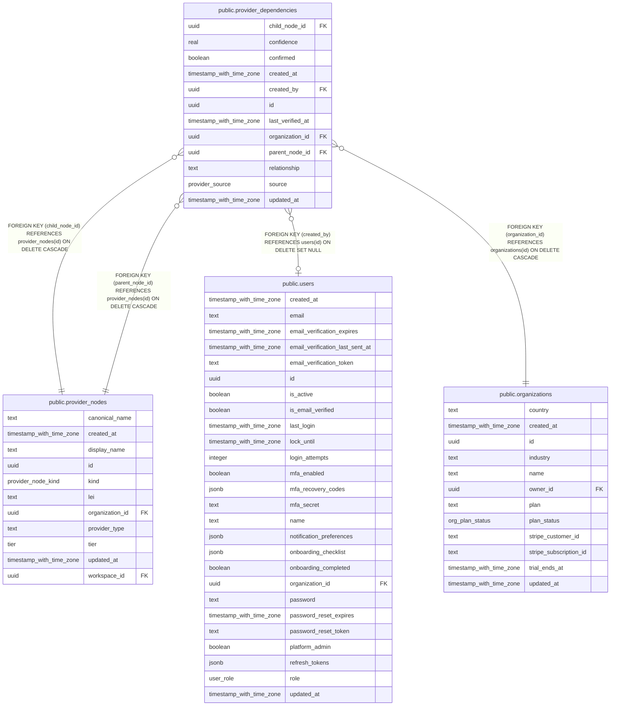

# public.provider_dependencies

## Columns

| Name             | Type                     | Default                   | Nullable | Children | Parents                                           | Comment |
| ---------------- | ------------------------ | ------------------------- | -------- | -------- | ------------------------------------------------- | ------- |
| child_node_id    | uuid                     |                           | false    |          | [public.provider_nodes](public.provider_nodes.md) |         |
| confidence       | real                     | 1                         | false    |          |                                                   |         |
| confirmed        | boolean                  | true                      | false    |          |                                                   |         |
| created_at       | timestamp with time zone | now()                     | false    |          |                                                   |         |
| created_by       | uuid                     |                           | true     |          | [public.users](public.users.md)                   |         |
| id               | uuid                     | gen_random_uuid()         | false    |          |                                                   |         |
| last_verified_at | timestamp with time zone | now()                     | false    |          |                                                   |         |
| organization_id  | uuid                     |                           | false    |          | [public.organizations](public.organizations.md)   |         |
| parent_node_id   | uuid                     |                           | false    |          | [public.provider_nodes](public.provider_nodes.md) |         |
| relationship     | text                     | 'sub_processes_via'::text | false    |          |                                                   |         |
| source           | provider_source          | 'manual'::provider_source | false    |          |                                                   |         |
| updated_at       | timestamp with time zone | now()                     | false    |          |                                                   |         |

## Constraints

| Name                                                      | Type        | Definition                                                                   |
| --------------------------------------------------------- | ----------- | ---------------------------------------------------------------------------- |
| provider_dependencies_child_node_id_provider_nodes_id_fk  | FOREIGN KEY | FOREIGN KEY (child_node_id) REFERENCES provider_nodes(id) ON DELETE CASCADE  |
| provider_dependencies_created_by_users_id_fk              | FOREIGN KEY | FOREIGN KEY (created_by) REFERENCES users(id) ON DELETE SET NULL             |
| provider_dependencies_organization_id_organizations_id_fk | FOREIGN KEY | FOREIGN KEY (organization_id) REFERENCES organizations(id) ON DELETE CASCADE |
| provider_dependencies_parent_node_id_provider_nodes_id_fk | FOREIGN KEY | FOREIGN KEY (parent_node_id) REFERENCES provider_nodes(id) ON DELETE CASCADE |
| provider_dependencies_pkey                                | PRIMARY KEY | PRIMARY KEY (id)                                                             |

## Indexes

| Name                       | Definition                                                                                                                            |
| -------------------------- | ------------------------------------------------------------------------------------------------------------------------------------- |
| provider_dependencies_pkey | CREATE UNIQUE INDEX provider_dependencies_pkey ON public.provider_dependencies USING btree (id)                                       |
| provider_deps_child_idx    | CREATE INDEX provider_deps_child_idx ON public.provider_dependencies USING btree (child_node_id)                                      |
| provider_deps_edge_uniq    | CREATE UNIQUE INDEX provider_deps_edge_uniq ON public.provider_dependencies USING btree (parent_node_id, child_node_id, relationship) |
| provider_deps_org_idx      | CREATE INDEX provider_deps_org_idx ON public.provider_dependencies USING btree (organization_id)                                      |
| provider_deps_parent_idx   | CREATE INDEX provider_deps_parent_idx ON public.provider_dependencies USING btree (parent_node_id)                                    |

## Relations

---

> Generated by [tbls](https://github.com/k1LoW/tbls)
