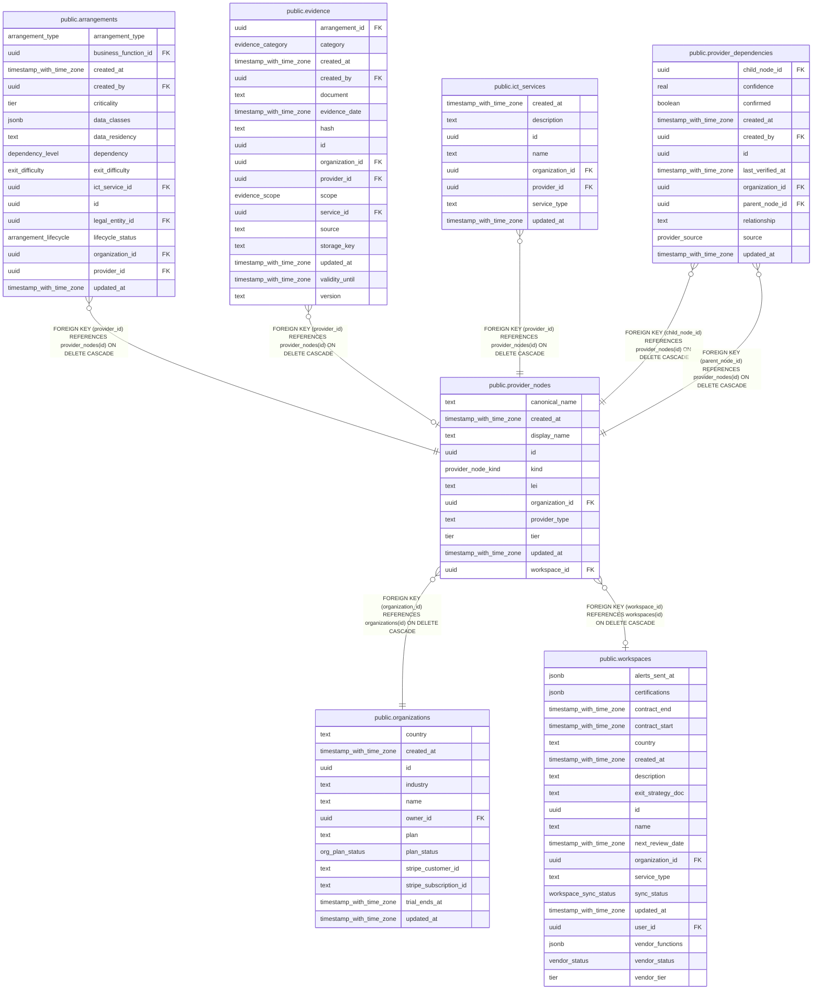

# public.provider_nodes

## Columns

| Name            | Type                     | Default           | Nullable | Children                                                                                                                                                                                          | Parents                                         | Comment |
| --------------- | ------------------------ | ----------------- | -------- | ------------------------------------------------------------------------------------------------------------------------------------------------------------------------------------------------- | ----------------------------------------------- | ------- |
| canonical_name  | text                     |                   | false    |                                                                                                                                                                                                   |                                                 |         |
| created_at      | timestamp with time zone | now()             | false    |                                                                                                                                                                                                   |                                                 |         |
| display_name    | text                     |                   | false    |                                                                                                                                                                                                   |                                                 |         |
| id              | uuid                     | gen_random_uuid() | false    | [public.arrangements](public.arrangements.md) [public.evidence](public.evidence.md) [public.ict_services](public.ict_services.md) [public.provider_dependencies](public.provider_dependencies.md) |                                                 |         |
| kind            | provider_node_kind       |                   | false    |                                                                                                                                                                                                   |                                                 |         |
| lei             | text                     |                   | true     |                                                                                                                                                                                                   |                                                 |         |
| organization_id | uuid                     |                   | false    |                                                                                                                                                                                                   | [public.organizations](public.organizations.md) |         |
| provider_type   | text                     |                   | true     |                                                                                                                                                                                                   |                                                 |         |
| tier            | tier                     |                   | true     |                                                                                                                                                                                                   |                                                 |         |
| updated_at      | timestamp with time zone | now()             | false    |                                                                                                                                                                                                   |                                                 |         |
| workspace_id    | uuid                     |                   | true     |                                                                                                                                                                                                   | [public.workspaces](public.workspaces.md)       |         |

## Constraints

| Name                                               | Type        | Definition                                                                                                                                                       |
| -------------------------------------------------- | ----------- | ---------------------------------------------------------------------------------------------------------------------------------------------------------------- |
| provider_nodes_organization_id_organizations_id_fk | FOREIGN KEY | FOREIGN KEY (organization_id) REFERENCES organizations(id) ON DELETE CASCADE                                                                                     |
| provider_nodes_pkey                                | PRIMARY KEY | PRIMARY KEY (id)                                                                                                                                                 |
| provider_nodes_provider_type_check                 | CHECK       | CHECK (((provider_type IS NULL) OR (provider_type = ANY (ARRAY['cloud'::text, 'ai_ml'::text, 'software'::text, 'data'::text, 'network'::text, 'other'::text])))) |
| provider_nodes_workspace_id_workspaces_id_fk       | FOREIGN KEY | FOREIGN KEY (workspace_id) REFERENCES workspaces(id) ON DELETE CASCADE                                                                                           |

## Indexes

| Name                              | Definition                                                                                                                   |
| --------------------------------- | ---------------------------------------------------------------------------------------------------------------------------- |
| provider_nodes_org_canonical_uniq | CREATE UNIQUE INDEX provider_nodes_org_canonical_uniq ON public.provider_nodes USING btree (organization_id, canonical_name) |
| provider_nodes_org_idx            | CREATE INDEX provider_nodes_org_idx ON public.provider_nodes USING btree (organization_id)                                   |
| provider_nodes_pkey               | CREATE UNIQUE INDEX provider_nodes_pkey ON public.provider_nodes USING btree (id)                                            |
| provider_nodes_workspace_idx      | CREATE INDEX provider_nodes_workspace_idx ON public.provider_nodes USING btree (workspace_id)                                |

## Relations

---

> Generated by [tbls](https://github.com/k1LoW/tbls)
