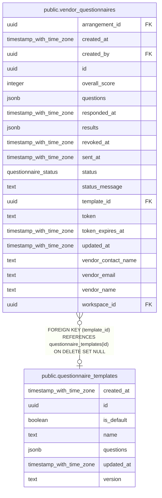

# public.questionnaire_templates

## Columns

| Name       | Type                     | Default           | Nullable | Children                                                        | Parents | Comment |
| ---------- | ------------------------ | ----------------- | -------- | --------------------------------------------------------------- | ------- | ------- |
| created_at | timestamp with time zone | now()             | false    |                                                                 |         |         |
| id         | uuid                     | gen_random_uuid() | false    | [public.vendor_questionnaires](public.vendor_questionnaires.md) |         |         |
| is_default | boolean                  | false             | false    |                                                                 |         |         |
| name       | text                     |                   | false    |                                                                 |         |         |
| questions  | jsonb                    | '[]'::jsonb       | false    |                                                                 |         |         |
| updated_at | timestamp with time zone | now()             | false    |                                                                 |         |         |
| version    | text                     | '1.0'::text       | false    |                                                                 |         |         |

## Constraints

| Name                         | Type        | Definition       |
| ---------------------------- | ----------- | ---------------- |
| questionnaire_templates_pkey | PRIMARY KEY | PRIMARY KEY (id) |

## Indexes

| Name                                   | Definition                                                                                                     |
| -------------------------------------- | -------------------------------------------------------------------------------------------------------------- |
| questionnaire_templates_is_default_idx | CREATE INDEX questionnaire_templates_is_default_idx ON public.questionnaire_templates USING btree (is_default) |
| questionnaire_templates_pkey           | CREATE UNIQUE INDEX questionnaire_templates_pkey ON public.questionnaire_templates USING btree (id)            |

## Relations

---

> Generated by [tbls](https://github.com/k1LoW/tbls)
