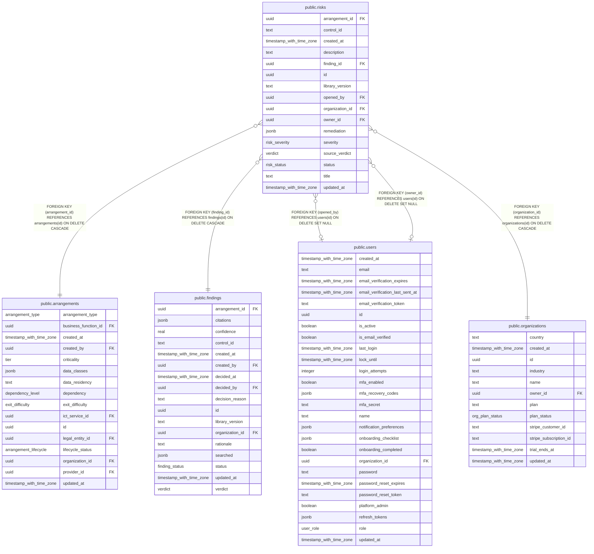

# public.risks

## Columns

| Name            | Type                     | Default             | Nullable | Children | Parents                                         | Comment |
| --------------- | ------------------------ | ------------------- | -------- | -------- | ----------------------------------------------- | ------- |
| arrangement_id  | uuid                     |                     | false    |          | [public.arrangements](public.arrangements.md)   |         |
| control_id      | text                     |                     | false    |          |                                                 |         |
| created_at      | timestamp with time zone | now()               | false    |          |                                                 |         |
| description     | text                     | ''::text            | false    |          |                                                 |         |
| finding_id      | uuid                     |                     | false    |          | [public.findings](public.findings.md)           |         |
| id              | uuid                     | gen_random_uuid()   | false    |          |                                                 |         |
| library_version | text                     |                     | false    |          |                                                 |         |
| opened_by       | uuid                     |                     | true     |          | [public.users](public.users.md)                 |         |
| organization_id | uuid                     |                     | false    |          | [public.organizations](public.organizations.md) |         |
| owner_id        | uuid                     |                     | true     |          | [public.users](public.users.md)                 |         |
| remediation     | jsonb                    | '[]'::jsonb         | false    |          |                                                 |         |
| severity        | risk_severity            |                     | false    |          |                                                 |         |
| source_verdict  | verdict                  |                     | false    |          |                                                 |         |
| status          | risk_status              | 'open'::risk_status | false    |          |                                                 |         |
| title           | text                     |                     | false    |          |                                                 |         |
| updated_at      | timestamp with time zone | now()               | false    |          |                                                 |         |

## Constraints

| Name                                      | Type        | Definition                                                                   |
| ----------------------------------------- | ----------- | ---------------------------------------------------------------------------- |
| risks_arrangement_id_arrangements_id_fk   | FOREIGN KEY | FOREIGN KEY (arrangement_id) REFERENCES arrangements(id) ON DELETE CASCADE   |
| risks_finding_id_findings_id_fk           | FOREIGN KEY | FOREIGN KEY (finding_id) REFERENCES findings(id) ON DELETE CASCADE           |
| risks_opened_by_users_id_fk               | FOREIGN KEY | FOREIGN KEY (opened_by) REFERENCES users(id) ON DELETE SET NULL              |
| risks_organization_id_organizations_id_fk | FOREIGN KEY | FOREIGN KEY (organization_id) REFERENCES organizations(id) ON DELETE CASCADE |
| risks_owner_id_users_id_fk                | FOREIGN KEY | FOREIGN KEY (owner_id) REFERENCES users(id) ON DELETE SET NULL               |
| risks_pkey                                | PRIMARY KEY | PRIMARY KEY (id)                                                             |

## Indexes

| Name                  | Definition                                                                                       |
| --------------------- | ------------------------------------------------------------------------------------------------ |
| risks_arrangement_idx | CREATE INDEX risks_arrangement_idx ON public.risks USING btree (arrangement_id)                  |
| risks_finding_uniq    | CREATE UNIQUE INDEX risks_finding_uniq ON public.risks USING btree (organization_id, finding_id) |
| risks_org_idx         | CREATE INDEX risks_org_idx ON public.risks USING btree (organization_id)                         |
| risks_pkey            | CREATE UNIQUE INDEX risks_pkey ON public.risks USING btree (id)                                  |
| risks_status_idx      | CREATE INDEX risks_status_idx ON public.risks USING btree (organization_id, status)              |

## Relations

---

> Generated by [tbls](https://github.com/k1LoW/tbls)
