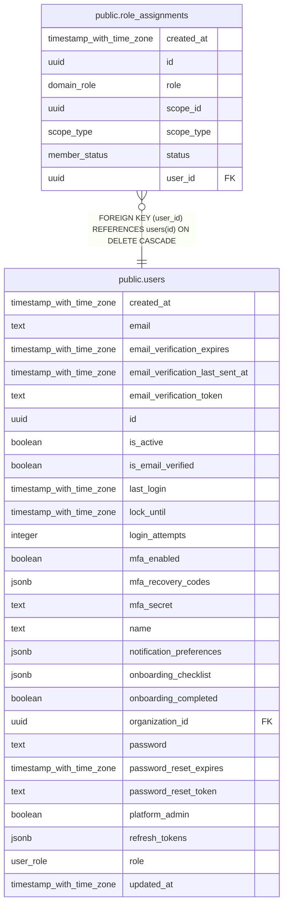

# public.role_assignments

## Columns

| Name       | Type                     | Default                 | Nullable | Children | Parents                         | Comment |
| ---------- | ------------------------ | ----------------------- | -------- | -------- | ------------------------------- | ------- |
| created_at | timestamp with time zone | now()                   | false    |          |                                 |         |
| id         | uuid                     | gen_random_uuid()       | false    |          |                                 |         |
| role       | domain_role              |                         | false    |          |                                 |         |
| scope_id   | uuid                     |                         | false    |          |                                 |         |
| scope_type | scope_type               |                         | false    |          |                                 |         |
| status     | member_status            | 'active'::member_status | false    |          |                                 |         |
| user_id    | uuid                     |                         | false    |          | [public.users](public.users.md) |         |

## Constraints

| Name                                 | Type        | Definition                                                   |
| ------------------------------------ | ----------- | ------------------------------------------------------------ |
| role_assignments_pkey                | PRIMARY KEY | PRIMARY KEY (id)                                             |
| role_assignments_user_id_users_id_fk | FOREIGN KEY | FOREIGN KEY (user_id) REFERENCES users(id) ON DELETE CASCADE |

## Indexes

| Name                                  | Definition                                                                                                                             |
| ------------------------------------- | -------------------------------------------------------------------------------------------------------------------------------------- |
| role_assignments_pkey                 | CREATE UNIQUE INDEX role_assignments_pkey ON public.role_assignments USING btree (id)                                                  |
| role_assignments_scope_idx            | CREATE INDEX role_assignments_scope_idx ON public.role_assignments USING btree (scope_type, scope_id)                                  |
| role_assignments_user_id_idx          | CREATE INDEX role_assignments_user_id_idx ON public.role_assignments USING btree (user_id)                                             |
| role_assignments_user_scope_role_uniq | CREATE UNIQUE INDEX role_assignments_user_scope_role_uniq ON public.role_assignments USING btree (user_id, scope_type, scope_id, role) |

## Relations

---

> Generated by [tbls](https://github.com/k1LoW/tbls)
