# public.users

## Columns

| Name                            | Type                     | Default                                                                                                                                                                                                                                                                                                                                                                                                                                                                                                      | Nullable | Children                                                                                                                                                                                                                                                                                                                                                                                                                                                                                                                                                                                                                                                                                                                                                                                                                                  | Parents                                         | Comment |
| ------------------------------- | ------------------------ | ------------------------------------------------------------------------------------------------------------------------------------------------------------------------------------------------------------------------------------------------------------------------------------------------------------------------------------------------------------------------------------------------------------------------------------------------------------------------------------------------------------ | -------- | ----------------------------------------------------------------------------------------------------------------------------------------------------------------------------------------------------------------------------------------------------------------------------------------------------------------------------------------------------------------------------------------------------------------------------------------------------------------------------------------------------------------------------------------------------------------------------------------------------------------------------------------------------------------------------------------------------------------------------------------------------------------------------------------------------------------------------------------- | ----------------------------------------------- | ------- |
| created_at                      | timestamp with time zone | now()                                                                                                                                                                                                                                                                                                                                                                                                                                                                                                        | false    |                                                                                                                                                                                                                                                                                                                                                                                                                                                                                                                                                                                                                                                                                                                                                                                                                                           |                                                 |         |
| email                           | text                     |                                                                                                                                                                                                                                                                                                                                                                                                                                                                                                              | false    |                                                                                                                                                                                                                                                                                                                                                                                                                                                                                                                                                                                                                                                                                                                                                                                                                                           |                                                 |         |
| email_verification_expires      | timestamp with time zone |                                                                                                                                                                                                                                                                                                                                                                                                                                                                                                              | true     |                                                                                                                                                                                                                                                                                                                                                                                                                                                                                                                                                                                                                                                                                                                                                                                                                                           |                                                 |         |
| email_verification_last_sent_at | timestamp with time zone |                                                                                                                                                                                                                                                                                                                                                                                                                                                                                                              | true     |                                                                                                                                                                                                                                                                                                                                                                                                                                                                                                                                                                                                                                                                                                                                                                                                                                           |                                                 |         |
| email_verification_token        | text                     |                                                                                                                                                                                                                                                                                                                                                                                                                                                                                                              | true     |                                                                                                                                                                                                                                                                                                                                                                                                                                                                                                                                                                                                                                                                                                                                                                                                                                           |                                                 |         |
| id                              | uuid                     | gen_random_uuid()                                                                                                                                                                                                                                                                                                                                                                                                                                                                                            | false    | [public.arrangements](public.arrangements.md) [public.assessments](public.assessments.md) [public.audit_log](public.audit_log.md) [public.conversations](public.conversations.md) [public.critical_functions](public.critical_functions.md) [public.evidence](public.evidence.md) [public.evidence_collection_request](public.evidence_collection_request.md) [public.findings](public.findings.md) [public.organization_members](public.organization_members.md) [public.organizations](public.organizations.md) [public.provider_dependencies](public.provider_dependencies.md) [public.risks](public.risks.md) [public.role_assignments](public.role_assignments.md) [public.vendor_questionnaires](public.vendor_questionnaires.md) [public.workspace_members](public.workspace_members.md) [public.workspaces](public.workspaces.md) |                                                 |         |
| is_active                       | boolean                  | true                                                                                                                                                                                                                                                                                                                                                                                                                                                                                                         | false    |                                                                                                                                                                                                                                                                                                                                                                                                                                                                                                                                                                                                                                                                                                                                                                                                                                           |                                                 |         |
| is_email_verified               | boolean                  | false                                                                                                                                                                                                                                                                                                                                                                                                                                                                                                        | false    |                                                                                                                                                                                                                                                                                                                                                                                                                                                                                                                                                                                                                                                                                                                                                                                                                                           |                                                 |         |
| last_login                      | timestamp with time zone |                                                                                                                                                                                                                                                                                                                                                                                                                                                                                                              | true     |                                                                                                                                                                                                                                                                                                                                                                                                                                                                                                                                                                                                                                                                                                                                                                                                                                           |                                                 |         |
| lock_until                      | timestamp with time zone |                                                                                                                                                                                                                                                                                                                                                                                                                                                                                                              | true     |                                                                                                                                                                                                                                                                                                                                                                                                                                                                                                                                                                                                                                                                                                                                                                                                                                           |                                                 |         |
| login_attempts                  | integer                  | 0                                                                                                                                                                                                                                                                                                                                                                                                                                                                                                            | false    |                                                                                                                                                                                                                                                                                                                                                                                                                                                                                                                                                                                                                                                                                                                                                                                                                                           |                                                 |         |
| mfa_enabled                     | boolean                  | false                                                                                                                                                                                                                                                                                                                                                                                                                                                                                                        | false    |                                                                                                                                                                                                                                                                                                                                                                                                                                                                                                                                                                                                                                                                                                                                                                                                                                           |                                                 |         |
| mfa_recovery_codes              | jsonb                    |                                                                                                                                                                                                                                                                                                                                                                                                                                                                                                              | true     |                                                                                                                                                                                                                                                                                                                                                                                                                                                                                                                                                                                                                                                                                                                                                                                                                                           |                                                 |         |
| mfa_secret                      | text                     |                                                                                                                                                                                                                                                                                                                                                                                                                                                                                                              | true     |                                                                                                                                                                                                                                                                                                                                                                                                                                                                                                                                                                                                                                                                                                                                                                                                                                           |                                                 |         |
| name                            | text                     |                                                                                                                                                                                                                                                                                                                                                                                                                                                                                                              | false    |                                                                                                                                                                                                                                                                                                                                                                                                                                                                                                                                                                                                                                                                                                                                                                                                                                           |                                                 |         |
| notification_preferences        | jsonb                    | '{"email": {"sync_failed": true, "system_alert": true, "weekly_digest": true, "workspace_removed": true, "permission_changed": false, "token_limit_reached": true, "workspace_invitation": true}, "inApp": {"member_left": false, "sync_failed": true, "system_alert": true, "member_joined": true, "sync_completed": true, "indexing_failed": true, "workspace_removed": true, "indexing_completed": false, "permission_changed": true, "token_limit_warning": true, "workspace_invitation": true}}'::jsonb | false    |                                                                                                                                                                                                                                                                                                                                                                                                                                                                                                                                                                                                                                                                                                                                                                                                                                           |                                                 |         |
| onboarding_checklist            | jsonb                    | '{"dismissed": false, "memberInvited": false, "vendorCreated": false, "monitoringSetup": false, "assessmentCreated": false}'::jsonb                                                                                                                                                                                                                                                                                                                                                                          | false    |                                                                                                                                                                                                                                                                                                                                                                                                                                                                                                                                                                                                                                                                                                                                                                                                                                           |                                                 |         |
| onboarding_completed            | boolean                  | false                                                                                                                                                                                                                                                                                                                                                                                                                                                                                                        | false    |                                                                                                                                                                                                                                                                                                                                                                                                                                                                                                                                                                                                                                                                                                                                                                                                                                           |                                                 |         |
| organization_id                 | uuid                     |                                                                                                                                                                                                                                                                                                                                                                                                                                                                                                              | true     |                                                                                                                                                                                                                                                                                                                                                                                                                                                                                                                                                                                                                                                                                                                                                                                                                                           | [public.organizations](public.organizations.md) |         |
| password                        | text                     |                                                                                                                                                                                                                                                                                                                                                                                                                                                                                                              | false    |                                                                                                                                                                                                                                                                                                                                                                                                                                                                                                                                                                                                                                                                                                                                                                                                                                           |                                                 |         |
| password_reset_expires          | timestamp with time zone |                                                                                                                                                                                                                                                                                                                                                                                                                                                                                                              | true     |                                                                                                                                                                                                                                                                                                                                                                                                                                                                                                                                                                                                                                                                                                                                                                                                                                           |                                                 |         |
| password_reset_token            | text                     |                                                                                                                                                                                                                                                                                                                                                                                                                                                                                                              | true     |                                                                                                                                                                                                                                                                                                                                                                                                                                                                                                                                                                                                                                                                                                                                                                                                                                           |                                                 |         |
| platform_admin                  | boolean                  | false                                                                                                                                                                                                                                                                                                                                                                                                                                                                                                        | false    |                                                                                                                                                                                                                                                                                                                                                                                                                                                                                                                                                                                                                                                                                                                                                                                                                                           |                                                 |         |
| refresh_tokens                  | jsonb                    | '[]'::jsonb                                                                                                                                                                                                                                                                                                                                                                                                                                                                                                  | false    |                                                                                                                                                                                                                                                                                                                                                                                                                                                                                                                                                                                                                                                                                                                                                                                                                                           |                                                 |         |
| role                            | user_role                | 'user'::user_role                                                                                                                                                                                                                                                                                                                                                                                                                                                                                            | false    |                                                                                                                                                                                                                                                                                                                                                                                                                                                                                                                                                                                                                                                                                                                                                                                                                                           |                                                 |         |
| updated_at                      | timestamp with time zone | now()                                                                                                                                                                                                                                                                                                                                                                                                                                                                                                        | false    |                                                                                                                                                                                                                                                                                                                                                                                                                                                                                                                                                                                                                                                                                                                                                                                                                                           |                                                 |         |

## Constraints

| Name                                      | Type        | Definition                                                                    |
| ----------------------------------------- | ----------- | ----------------------------------------------------------------------------- |
| users_email_unique                        | UNIQUE      | UNIQUE (email)                                                                |
| users_organization_id_organizations_id_fk | FOREIGN KEY | FOREIGN KEY (organization_id) REFERENCES organizations(id) ON DELETE SET NULL |
| users_pkey                                | PRIMARY KEY | PRIMARY KEY (id)                                                              |

## Indexes

| Name                      | Definition                                                                           |
| ------------------------- | ------------------------------------------------------------------------------------ |
| users_email_unique        | CREATE UNIQUE INDEX users_email_unique ON public.users USING btree (email)           |
| users_organization_id_idx | CREATE INDEX users_organization_id_idx ON public.users USING btree (organization_id) |
| users_pkey                | CREATE UNIQUE INDEX users_pkey ON public.users USING btree (id)                      |

## Relations

```mermaid
erDiagram

"public.arrangements" }o--o| "public.users" : "FOREIGN KEY (created_by) REFERENCES users(id) ON DELETE SET NULL"
"public.assessments" }o--o| "public.users" : "FOREIGN KEY (created_by) REFERENCES users(id) ON DELETE SET NULL"
"public.audit_log" }o--o| "public.users" : "FOREIGN KEY (actor) REFERENCES users(id) ON DELETE SET NULL"
"public.conversations" }o--o| "public.users" : "FOREIGN KEY (user_id) REFERENCES users(id) ON DELETE SET NULL"
"public.critical_functions" }o--o| "public.users" : "FOREIGN KEY (created_by) REFERENCES users(id) ON DELETE SET NULL"
"public.evidence" }o--o| "public.users" : "FOREIGN KEY (created_by) REFERENCES users(id) ON DELETE SET NULL"
"public.evidence_collection_request" }o--o| "public.users" : "FOREIGN KEY (created_by) REFERENCES users(id) ON DELETE SET NULL"
"public.findings" }o--o| "public.users" : "FOREIGN KEY (created_by) REFERENCES users(id) ON DELETE SET NULL"
"public.findings" }o--o| "public.users" : "FOREIGN KEY (decided_by) REFERENCES users(id) ON DELETE SET NULL"
"public.organization_members" }o--o| "public.users" : "FOREIGN KEY (invited_by) REFERENCES users(id) ON DELETE SET NULL"
"public.organization_members" }o--o| "public.users" : "FOREIGN KEY (user_id) REFERENCES users(id) ON DELETE SET NULL"
"public.organizations" }o--|| "public.users" : "FOREIGN KEY (owner_id) REFERENCES users(id)"
"public.provider_dependencies" }o--o| "public.users" : "FOREIGN KEY (created_by) REFERENCES users(id) ON DELETE SET NULL"
"public.risks" }o--o| "public.users" : "FOREIGN KEY (opened_by) REFERENCES users(id) ON DELETE SET NULL"
"public.risks" }o--o| "public.users" : "FOREIGN KEY (owner_id) REFERENCES users(id) ON DELETE SET NULL"
"public.role_assignments" }o--|| "public.users" : "FOREIGN KEY (user_id) REFERENCES users(id) ON DELETE CASCADE"
"public.vendor_questionnaires" }o--o| "public.users" : "FOREIGN KEY (created_by) REFERENCES users(id) ON DELETE SET NULL"
"public.workspace_members" }o--o| "public.users" : "FOREIGN KEY (invited_by) REFERENCES users(id) ON DELETE SET NULL"
"public.workspace_members" }o--|| "public.users" : "FOREIGN KEY (user_id) REFERENCES users(id) ON DELETE CASCADE"
"public.workspaces" }o--|| "public.users" : "FOREIGN KEY (user_id) REFERENCES users(id)"
"public.users" }o--o| "public.organizations" : "FOREIGN KEY (organization_id) REFERENCES organizations(id) ON DELETE SET NULL"

"public.users" {
  timestamp_with_time_zone created_at
  text email
  timestamp_with_time_zone email_verification_expires
  timestamp_with_time_zone email_verification_last_sent_at
  text email_verification_token
  uuid id
  boolean is_active
  boolean is_email_verified
  timestamp_with_time_zone last_login
  timestamp_with_time_zone lock_until
  integer login_attempts
  boolean mfa_enabled
  jsonb mfa_recovery_codes
  text mfa_secret
  text name
  jsonb notification_preferences
  jsonb onboarding_checklist
  boolean onboarding_completed
  uuid organization_id FK
  text password
  timestamp_with_time_zone password_reset_expires
  text password_reset_token
  boolean platform_admin
  jsonb refresh_tokens
  user_role role
  timestamp_with_time_zone updated_at
}
"public.arrangements" {
  arrangement_type arrangement_type
  uuid business_function_id FK
  timestamp_with_time_zone created_at
  uuid created_by FK
  tier criticality
  jsonb data_classes
  text data_residency
  dependency_level dependency
  exit_difficulty exit_difficulty
  uuid ict_service_id FK
  uuid id
  uuid legal_entity_id FK
  arrangement_lifecycle lifecycle_status
  uuid organization_id FK
  uuid provider_id FK
  timestamp_with_time_zone updated_at
}
"public.assessments" {
  jsonb clause_signoffs
  timestamp_with_time_zone created_at
  uuid created_by FK
  jsonb documents
  assessment_framework framework
  uuid id
  text name
  text report_path
  jsonb results
  jsonb risk_decision
  assessment_status status
  text status_message
  timestamp_with_time_zone updated_at
  text vendor_name
  uuid workspace_id FK
}
"public.audit_log" {
  text action
  uuid actor FK
  timestamp_with_time_zone created_at
  jsonb evidence_refs
  uuid id
  jsonb metadata
  uuid organization_id FK
  uuid target_id
  text target_type
}
"public.conversations" {
  timestamp_with_time_zone created_at
  uuid id
  text idempotency_key
  timestamp_with_time_zone last_message_at
  integer message_count
  text title
  timestamp_with_time_zone updated_at
  uuid user_id FK
  uuid workspace_id FK
}
"public.critical_functions" {
  timestamp_with_time_zone created_at
  uuid created_by FK
  criticality criticality
  text description
  uuid id
  text name
  uuid organization_id FK
  timestamp_with_time_zone updated_at
}
"public.evidence" {
  uuid arrangement_id FK
  evidence_category category
  timestamp_with_time_zone created_at
  uuid created_by FK
  text document
  timestamp_with_time_zone evidence_date
  text hash
  uuid id
  uuid organization_id FK
  uuid provider_id FK
  evidence_scope scope
  uuid service_id FK
  text source
  text storage_key
  timestamp_with_time_zone updated_at
  timestamp_with_time_zone validity_until
  text version
}
"public.evidence_collection_request" {
  uuid arrangement_id FK
  timestamp_with_time_zone created_at
  uuid created_by FK
  timestamp_with_time_zone fulfilled_at
  uuid id
  text message
  uuid organization_id FK
  jsonb requested_categories
  timestamp_with_time_zone revoked_at
  evidence_request_status status
  text token
  timestamp_with_time_zone token_expires_at
  timestamp_with_time_zone updated_at
  text vendor_contact_name
  text vendor_email
}
"public.findings" {
  uuid arrangement_id FK
  jsonb citations
  real confidence
  text control_id
  timestamp_with_time_zone created_at
  uuid created_by FK
  timestamp_with_time_zone decided_at
  uuid decided_by FK
  text decision_reason
  uuid id
  text library_version
  uuid organization_id FK
  text rationale
  jsonb searched
  finding_status status
  timestamp_with_time_zone updated_at
  verdict verdict
}
"public.organization_members" {
  timestamp_with_time_zone created_at
  text email
  uuid id
  timestamp_with_time_zone invite_token_expires
  text invite_token_hash
  uuid invited_by FK
  text invited_domain_role
  timestamp_with_time_zone joined_at
  uuid organization_id FK
  org_member_role role
  member_status status
  timestamp_with_time_zone updated_at
  uuid user_id FK
}
"public.organizations" {
  text country
  timestamp_with_time_zone created_at
  uuid id
  text industry
  text name
  uuid owner_id FK
  text plan
  org_plan_status plan_status
  text stripe_customer_id
  text stripe_subscription_id
  timestamp_with_time_zone trial_ends_at
  timestamp_with_time_zone updated_at
}
"public.provider_dependencies" {
  uuid child_node_id FK
  real confidence
  boolean confirmed
  timestamp_with_time_zone created_at
  uuid created_by FK
  uuid id
  timestamp_with_time_zone last_verified_at
  uuid organization_id FK
  uuid parent_node_id FK
  text relationship
  provider_source source
  timestamp_with_time_zone updated_at
}
"public.risks" {
  uuid arrangement_id FK
  text control_id
  timestamp_with_time_zone created_at
  text description
  uuid finding_id FK
  uuid id
  text library_version
  uuid opened_by FK
  uuid organization_id FK
  uuid owner_id FK
  jsonb remediation
  risk_severity severity
  verdict source_verdict
  risk_status status
  text title
  timestamp_with_time_zone updated_at
}
"public.role_assignments" {
  timestamp_with_time_zone created_at
  uuid id
  domain_role role
  uuid scope_id
  scope_type scope_type
  member_status status
  uuid user_id FK
}
"public.vendor_questionnaires" {
  uuid arrangement_id FK
  timestamp_with_time_zone created_at
  uuid created_by FK
  uuid id
  integer overall_score
  jsonb questions
  timestamp_with_time_zone responded_at
  jsonb results
  timestamp_with_time_zone revoked_at
  timestamp_with_time_zone sent_at
  questionnaire_status status
  text status_message
  uuid template_id FK
  text token
  timestamp_with_time_zone token_expires_at
  timestamp_with_time_zone updated_at
  text vendor_contact_name
  text vendor_email
  text vendor_name
  uuid workspace_id FK
}
"public.workspace_members" {
  timestamp_with_time_zone created_at
  uuid id
  timestamp_with_time_zone invited_at
  uuid invited_by FK
  jsonb permissions
  workspace_member_role role
  member_status status
  timestamp_with_time_zone updated_at
  uuid user_id FK
  uuid workspace_id FK
}
"public.workspaces" {
  jsonb alerts_sent_at
  jsonb certifications
  timestamp_with_time_zone contract_end
  timestamp_with_time_zone contract_start
  text country
  timestamp_with_time_zone created_at
  text description
  text exit_strategy_doc
  uuid id
  text name
  timestamp_with_time_zone next_review_date
  uuid organization_id FK
  text service_type
  workspace_sync_status sync_status
  timestamp_with_time_zone updated_at
  uuid user_id FK
  jsonb vendor_functions
  vendor_status vendor_status
  tier vendor_tier
}
```

---

> Generated by [tbls](https://github.com/k1LoW/tbls)
