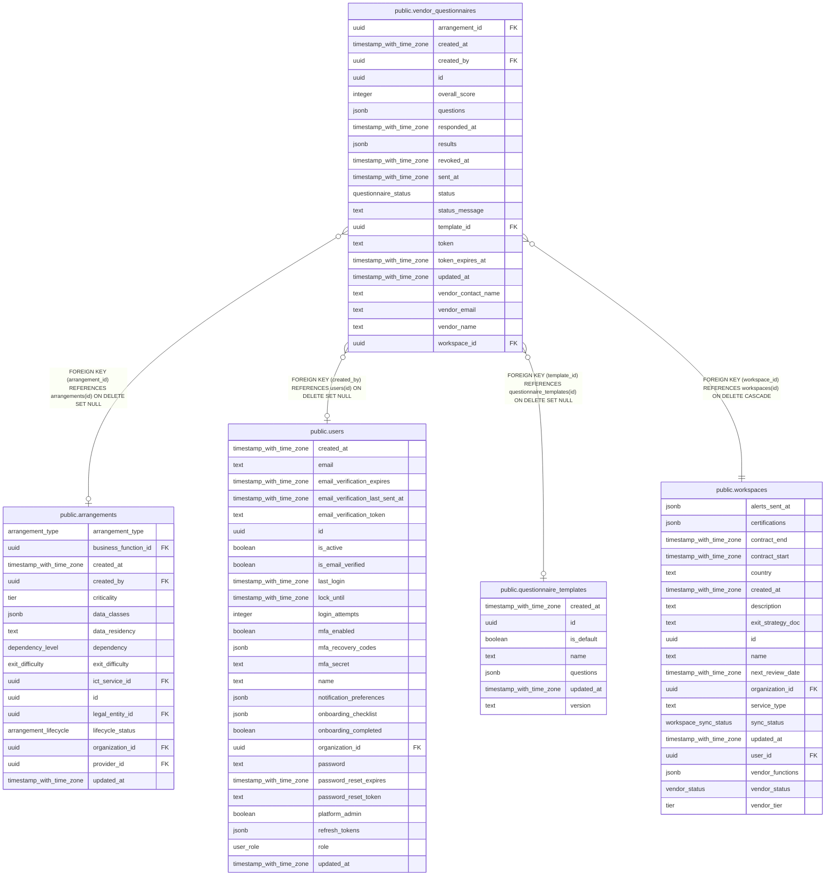

# public.vendor_questionnaires

## Columns

| Name                | Type                     | Default                       | Nullable | Children | Parents                                                             | Comment |
| ------------------- | ------------------------ | ----------------------------- | -------- | -------- | ------------------------------------------------------------------- | ------- |
| arrangement_id      | uuid                     |                               | true     |          | [public.arrangements](public.arrangements.md)                       |         |
| created_at          | timestamp with time zone | now()                         | false    |          |                                                                     |         |
| created_by          | uuid                     |                               | true     |          | [public.users](public.users.md)                                     |         |
| id                  | uuid                     | gen_random_uuid()             | false    |          |                                                                     |         |
| overall_score       | integer                  |                               | true     |          |                                                                     |         |
| questions           | jsonb                    | '[]'::jsonb                   | false    |          |                                                                     |         |
| responded_at        | timestamp with time zone |                               | true     |          |                                                                     |         |
| results             | jsonb                    |                               | true     |          |                                                                     |         |
| revoked_at          | timestamp with time zone |                               | true     |          |                                                                     |         |
| sent_at             | timestamp with time zone |                               | true     |          |                                                                     |         |
| status              | questionnaire_status     | 'draft'::questionnaire_status | false    |          |                                                                     |         |
| status_message      | text                     | ''::text                      | false    |          |                                                                     |         |
| template_id         | uuid                     |                               | true     |          | [public.questionnaire_templates](public.questionnaire_templates.md) |         |
| token               | text                     |                               | true     |          |                                                                     |         |
| token_expires_at    | timestamp with time zone |                               | true     |          |                                                                     |         |
| updated_at          | timestamp with time zone | now()                         | false    |          |                                                                     |         |
| vendor_contact_name | text                     | ''::text                      | false    |          |                                                                     |         |
| vendor_email        | text                     |                               | false    |          |                                                                     |         |
| vendor_name         | text                     |                               | false    |          |                                                                     |         |
| workspace_id        | uuid                     |                               | false    |          | [public.workspaces](public.workspaces.md)                           |         |

## Constraints

| Name                                                            | Type        | Definition                                                                          |
| --------------------------------------------------------------- | ----------- | ----------------------------------------------------------------------------------- |
| vendor_questionnaires_arrangement_id_arrangements_id_fk         | FOREIGN KEY | FOREIGN KEY (arrangement_id) REFERENCES arrangements(id) ON DELETE SET NULL         |
| vendor_questionnaires_created_by_users_id_fk                    | FOREIGN KEY | FOREIGN KEY (created_by) REFERENCES users(id) ON DELETE SET NULL                    |
| vendor_questionnaires_pkey                                      | PRIMARY KEY | PRIMARY KEY (id)                                                                    |
| vendor_questionnaires_template_id_questionnaire_templates_id_fk | FOREIGN KEY | FOREIGN KEY (template_id) REFERENCES questionnaire_templates(id) ON DELETE SET NULL |
| vendor_questionnaires_workspace_id_workspaces_id_fk             | FOREIGN KEY | FOREIGN KEY (workspace_id) REFERENCES workspaces(id) ON DELETE CASCADE              |

## Indexes

| Name                                       | Definition                                                                                                                               |
| ------------------------------------------ | ---------------------------------------------------------------------------------------------------------------------------------------- |
| vendor_questionnaires_createdby_status_idx | CREATE INDEX vendor_questionnaires_createdby_status_idx ON public.vendor_questionnaires USING btree (created_by, status)                 |
| vendor_questionnaires_pkey                 | CREATE UNIQUE INDEX vendor_questionnaires_pkey ON public.vendor_questionnaires USING btree (id)                                          |
| vendor_questionnaires_token_uniq           | CREATE UNIQUE INDEX vendor_questionnaires_token_uniq ON public.vendor_questionnaires USING btree (token) WHERE (token IS NOT NULL)       |
| vendor_questionnaires_ws_created_idx       | CREATE INDEX vendor_questionnaires_ws_created_idx ON public.vendor_questionnaires USING btree (workspace_id, created_at DESC NULLS LAST) |

## Relations

---

> Generated by [tbls](https://github.com/k1LoW/tbls)
