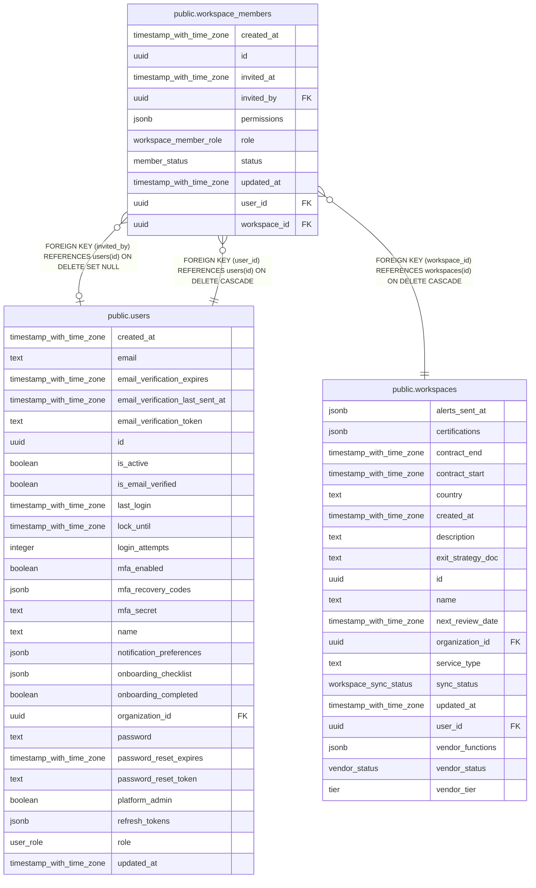

# public.workspace_members

## Columns

| Name         | Type                     | Default                                                                 | Nullable | Children | Parents                                   | Comment |
| ------------ | ------------------------ | ----------------------------------------------------------------------- | -------- | -------- | ----------------------------------------- | ------- |
| created_at   | timestamp with time zone | now()                                                                   | false    |          |                                           |         |
| id           | uuid                     | gen_random_uuid()                                                       | false    |          |                                           |         |
| invited_at   | timestamp with time zone | now()                                                                   | false    |          |                                           |         |
| invited_by   | uuid                     |                                                                         | true     |          | [public.users](public.users.md)           |         |
| permissions  | jsonb                    | '{"canQuery": true, "canInvite": false, "canViewSources": true}'::jsonb | false    |          |                                           |         |
| role         | workspace_member_role    | 'member'::workspace_member_role                                         | false    |          |                                           |         |
| status       | member_status            | 'active'::member_status                                                 | false    |          |                                           |         |
| updated_at   | timestamp with time zone | now()                                                                   | false    |          |                                           |         |
| user_id      | uuid                     |                                                                         | false    |          | [public.users](public.users.md)           |         |
| workspace_id | uuid                     |                                                                         | false    |          | [public.workspaces](public.workspaces.md) |         |

## Constraints

| Name                                            | Type        | Definition                                                             |
| ----------------------------------------------- | ----------- | ---------------------------------------------------------------------- |
| workspace_members_invited_by_users_id_fk        | FOREIGN KEY | FOREIGN KEY (invited_by) REFERENCES users(id) ON DELETE SET NULL       |
| workspace_members_pkey                          | PRIMARY KEY | PRIMARY KEY (id)                                                       |
| workspace_members_user_id_users_id_fk           | FOREIGN KEY | FOREIGN KEY (user_id) REFERENCES users(id) ON DELETE CASCADE           |
| workspace_members_workspace_id_workspaces_id_fk | FOREIGN KEY | FOREIGN KEY (workspace_id) REFERENCES workspaces(id) ON DELETE CASCADE |

## Indexes

| Name                              | Definition                                                                                                         |
| --------------------------------- | ------------------------------------------------------------------------------------------------------------------ |
| workspace_members_pkey            | CREATE UNIQUE INDEX workspace_members_pkey ON public.workspace_members USING btree (id)                            |
| workspace_members_user_status_idx | CREATE INDEX workspace_members_user_status_idx ON public.workspace_members USING btree (user_id, status)           |
| workspace_members_ws_user_uniq    | CREATE UNIQUE INDEX workspace_members_ws_user_uniq ON public.workspace_members USING btree (workspace_id, user_id) |

## Relations

---

> Generated by [tbls](https://github.com/k1LoW/tbls)
