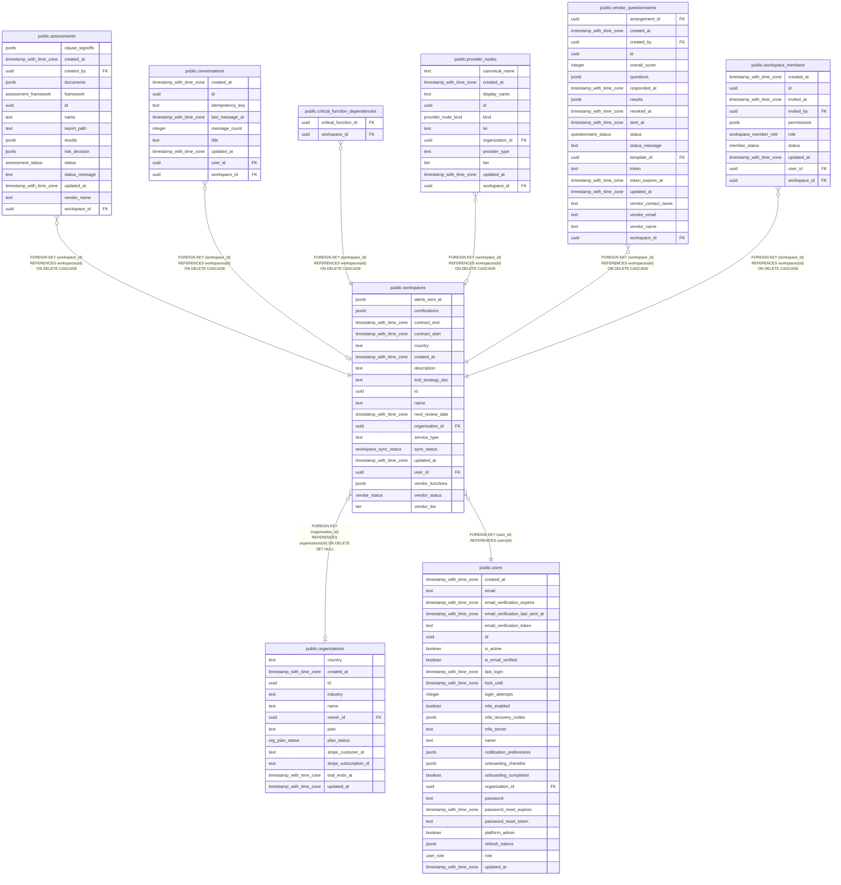

# public.workspaces

## Columns

| Name              | Type                     | Default                       | Nullable | Children                                                                                                                                                                                                                                                                                                                                                | Parents                                         | Comment |
| ----------------- | ------------------------ | ----------------------------- | -------- | ------------------------------------------------------------------------------------------------------------------------------------------------------------------------------------------------------------------------------------------------------------------------------------------------------------------------------------------------------- | ----------------------------------------------- | ------- |
| alerts_sent_at    | jsonb                    | '{}'::jsonb                   | false    |                                                                                                                                                                                                                                                                                                                                                         |                                                 |         |
| certifications    | jsonb                    | '[]'::jsonb                   | false    |                                                                                                                                                                                                                                                                                                                                                         |                                                 |         |
| contract_end      | timestamp with time zone |                               | true     |                                                                                                                                                                                                                                                                                                                                                         |                                                 |         |
| contract_start    | timestamp with time zone |                               | true     |                                                                                                                                                                                                                                                                                                                                                         |                                                 |         |
| country           | text                     | ''::text                      | false    |                                                                                                                                                                                                                                                                                                                                                         |                                                 |         |
| created_at        | timestamp with time zone | now()                         | false    |                                                                                                                                                                                                                                                                                                                                                         |                                                 |         |
| description       | text                     | ''::text                      | false    |                                                                                                                                                                                                                                                                                                                                                         |                                                 |         |
| exit_strategy_doc | text                     |                               | true     |                                                                                                                                                                                                                                                                                                                                                         |                                                 |         |
| id                | uuid                     | gen_random_uuid()             | false    | [public.assessments](public.assessments.md) [public.conversations](public.conversations.md) [public.critical_function_dependencies](public.critical_function_dependencies.md) [public.provider_nodes](public.provider_nodes.md) [public.vendor_questionnaires](public.vendor_questionnaires.md) [public.workspace_members](public.workspace_members.md) |                                                 |         |
| name              | text                     |                               | false    |                                                                                                                                                                                                                                                                                                                                                         |                                                 |         |
| next_review_date  | timestamp with time zone |                               | true     |                                                                                                                                                                                                                                                                                                                                                         |                                                 |         |
| organization_id   | uuid                     |                               | true     |                                                                                                                                                                                                                                                                                                                                                         | [public.organizations](public.organizations.md) |         |
| service_type      | text                     |                               | true     |                                                                                                                                                                                                                                                                                                                                                         |                                                 |         |
| sync_status       | workspace_sync_status    | 'idle'::workspace_sync_status | false    |                                                                                                                                                                                                                                                                                                                                                         |                                                 |         |
| updated_at        | timestamp with time zone | now()                         | false    |                                                                                                                                                                                                                                                                                                                                                         |                                                 |         |
| user_id           | uuid                     |                               | false    |                                                                                                                                                                                                                                                                                                                                                         | [public.users](public.users.md)                 |         |
| vendor_functions  | jsonb                    | '[]'::jsonb                   | false    |                                                                                                                                                                                                                                                                                                                                                         |                                                 |         |
| vendor_status     | vendor_status            | 'under-review'::vendor_status | false    |                                                                                                                                                                                                                                                                                                                                                         |                                                 |         |
| vendor_tier       | tier                     |                               | true     |                                                                                                                                                                                                                                                                                                                                                         |                                                 |         |

## Constraints

| Name                                           | Type        | Definition                                                                                                                                      |
| ---------------------------------------------- | ----------- | ----------------------------------------------------------------------------------------------------------------------------------------------- |
| workspaces_organization_id_organizations_id_fk | FOREIGN KEY | FOREIGN KEY (organization_id) REFERENCES organizations(id) ON DELETE SET NULL                                                                   |
| workspaces_pkey                                | PRIMARY KEY | PRIMARY KEY (id)                                                                                                                                |
| workspaces_service_type_check                  | CHECK       | CHECK (((service_type IS NULL) OR (service_type = ANY (ARRAY['cloud'::text, 'software'::text, 'data'::text, 'network'::text, 'other'::text])))) |
| workspaces_user_id_users_id_fk                 | FOREIGN KEY | FOREIGN KEY (user_id) REFERENCES users(id)                                                                                                      |

## Indexes

| Name                           | Definition                                                                                     |
| ------------------------------ | ---------------------------------------------------------------------------------------------- |
| workspaces_organization_id_idx | CREATE INDEX workspaces_organization_id_idx ON public.workspaces USING btree (organization_id) |
| workspaces_pkey                | CREATE UNIQUE INDEX workspaces_pkey ON public.workspaces USING btree (id)                      |
| workspaces_user_id_idx         | CREATE INDEX workspaces_user_id_idx ON public.workspaces USING btree (user_id)                 |
| workspaces_user_name_idx       | CREATE INDEX workspaces_user_name_idx ON public.workspaces USING btree (user_id, name)         |

## Relations

---

> Generated by [tbls](https://github.com/k1LoW/tbls)
